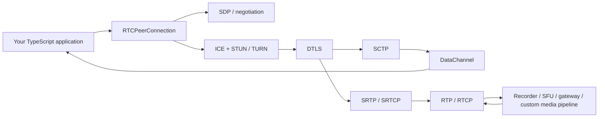

<div align="center">

# werift

### Programmable WebRTC for TypeScript & Node.js

Build media servers, gateways, recorders, bots, test peers, and custom real-time pipelines with a WebRTC stack you can inspect and extend all the way down to **RTP, RTCP, ICE, DTLS, SRTP, SCTP, and DataChannel**.

[](https://www.npmjs.com/package/werift)
[](https://www.npmjs.com/package/werift)
[](./LICENSE)
[](https://www.npmjs.com/package/werift)
[](https://github.com/shinyoshiaki/werift-webrtc)

[Documentation](https://shinyoshiaki.github.io/werift-webrtc/website/build/) · [API Reference](https://shinyoshiaki.github.io/werift-webrtc/website/build/docs/api) · [Examples](./examples) · [Issues](https://github.com/shinyoshiaki/werift-webrtc/issues)

</div>

---

**werift** (**We**b**R**TC **I**mplementation **f**or **T**ypeScript) is a WebRTC implementation for Node.js written in TypeScript.

It gives you a high-level `RTCPeerConnection` API when you want to build quickly, while still exposing the protocol layers and RTP packets needed for server-side media systems where the browser abstraction is not enough.

## Why werift?

- **TypeScript from PeerConnection down to the protocols** — work with WebRTC without wrapping a native browser engine or opaque native WebRTC binding.
- **RTP-first media model** — receive and send encoded RTP directly, making werift a natural fit for SFUs, recorders, relays, gateways, bots, and custom media processing.
- **Modular protocol stack** — ICE, DTLS, SCTP, and RTP are also available as focused packages for applications that do not need the whole WebRTC stack.
- **Built for interoperability** — compatibility is tracked against Chrome, Safari, Firefox, Pion, aiortc, sipsorcery, and webrtc-rs.
- **Server-oriented building blocks** — full/lite ICE, trickle ICE, ICE restart, STUN/TURN, DTLS-SRTP, DataChannel, RTP/RTCP feedback, simulcast receive, sender-side bandwidth estimation, and recording utilities.
- **Inspectable and extensible** — the packet path is yours. Add RTP transformations, custom congestion logic, protocol experiments, logging, or test instrumentation without crossing a native boundary.

## Install

```bash
npm install werift
```

The published `werift` package supports Node.js 16 or newer.

## Quick start

A complete in-process DataChannel connection can be created with only two peer connections and ordinary offer/answer signaling:

```ts
import { RTCPeerConnection } from "werift";

const offerer = new RTCPeerConnection({});
const answerer = new RTCPeerConnection({});

answerer.onDataChannel.subscribe((channel) => {
  channel.onMessage.subscribe((message) => {
    console.log("answerer received:", message.toString());
    channel.send(Buffer.from("hello from answerer"));
  });
});

const channel = offerer.createDataChannel("chat");

channel.stateChanged.subscribe((state) => {
  if (state === "open") {
    channel.send(Buffer.from("hello from offerer"));
  }
});

channel.onMessage.subscribe((message) => {
  console.log("offerer received:", message.toString());
});

await offerer.setLocalDescription(await offerer.createOffer());
await answerer.setRemoteDescription(offerer.localDescription!);

await answerer.setLocalDescription(await answerer.createAnswer());
await offerer.setRemoteDescription(answerer.localDescription!);
```

In a real application, replace the direct description exchange with your signaling transport: WebSocket, HTTP, SIP infrastructure, a queue, or anything else appropriate for your system.

See [`examples/datachannel`](./examples/datachannel) for runnable variants.

## A WebRTC stack that stays programmable

Browser WebRTC intentionally hides most packet-level details. Server-side systems often need the opposite.

werift does **not** try to provide browser capture/render APIs such as `getUserMedia()`. Instead, media can enter and leave the WebRTC stack as RTP packets. That makes it straightforward to connect werift to your own encoder, decoder, transcoder, recorder, RTP router, media pipeline, or test harness.



This design is especially useful when you need to understand, transform, record, relay, or test the media packets themselves.

## Features

| Area | Highlights |
| --- | --- |
| **PeerConnection** | Offer/answer negotiation, media directions, multiple tracks, DataChannel |
| **ICE** | Full ICE, ICE-Lite client/server modes, trickle ICE, ICE restart, STUN, TURN |
| **TURN transports** | UDP and TCP support, plus TURN/TLS loopback examples |
| **Security** | DTLS-SRTP, Curve25519, P-256, SRTP, SRTCP |
| **DataChannel** | SCTP over DTLS |
| **RTP / RTCP** | RFC 3550, SR/RR, PLI, Generic NACK, REMB, Transport-Wide CC |
| **Media resilience** | RTX and RED (RFC 2198) |
| **RTP payloads** | VP8, VP9, H.264, and AV1 RTP payload parsing |
| **Simulcast** | Receive-side simulcast |
| **Bandwidth estimation** | Sender-side BWE |
| **Recording** | MediaRecorder support for Opus, VP8, VP9, H.264, and AV1 workflows |
| **RTP processing** | Jitter buffer, RED encoder/decoder, DTX, NACK, lip-sync and other packet processors |

> werift is a WebRTC transport and media-packet stack. Codec capture, rendering, and general-purpose encode/decode are intentionally outside the core abstraction.

## What can you build?

### SFUs and RTP routers

Receive encoded RTP, inspect or transform it, then forward it to other peers without forcing your application through a browser-style media pipeline.

A separate SFU project built with werift is available at [node-sfu](https://github.com/shinyoshiaki/node-sfu).

### Recording and media ingestion

Record incoming WebRTC media or connect RTP to your existing storage/transcoding pipeline. See [`examples/save_to_disk`](./examples/save_to_disk) and the non-standard recorder APIs.

### Gateways and protocol bridges

Use WebRTC as one side of a larger system: SIP/media gateways, device bridges, realtime backends, relay services, or application-specific transports.

### Automated WebRTC peers

Because the stack runs in Node.js and exposes packet/protocol state, it works well for integration tests, interoperability suites, synthetic peers, load tests, and protocol debugging.

### Protocol experimentation

Use the lower layers directly when you need custom ICE, DTLS, SCTP, RTP/RTCP, congestion-control, or packet-processing behavior.

## Modular packages

You can use the full WebRTC package or only the protocol layer you need.

| Package | Purpose |
| --- | --- |
| [`werift`](https://www.npmjs.com/package/werift) | Complete WebRTC stack and `RTCPeerConnection` |
| [`werift-ice`](https://www.npmjs.com/package/werift-ice) | ICE / STUN / TURN implementation |
| [`werift-dtls`](https://www.npmjs.com/package/werift-dtls) | DTLS implementation |
| [`werift-sctp`](https://www.npmjs.com/package/werift-sctp) | SCTP implementation |
| [`werift-rtp`](https://www.npmjs.com/package/werift-rtp) | RTP / RTCP / SRTP / SRTCP and RTP processing utilities |

The top-level `werift` package also exports lower-level WebRTC transport and RTP primitives, so applications can mix high-level PeerConnection behavior with packet-level control.

## Interoperability

WebRTC only becomes useful when independent implementations can actually connect. Interoperability is therefore treated as a first-class concern.

Compatibility is tracked with:

- Chrome
- Safari
- Firefox
- Pion
- aiortc
- sipsorcery
- webrtc-rs

The repository includes browser E2E coverage and interoperability work with the [`webrtc-echoes`](https://github.com/sipsorcery/webrtc-echoes) ecosystem.

## Examples

The [`examples`](./examples) directory contains runnable examples for both high-level WebRTC use cases and lower-level media/protocol work.

| Example | What it demonstrates |
| --- | --- |
| [`examples/datachannel`](./examples/datachannel) | DataChannel offer/answer and messaging |
| [`examples/mediachannel`](./examples/mediachannel) | Sending and receiving WebRTC media |
| [`examples/save_to_disk`](./examples/save_to_disk) | Recording encoded WebRTC media |
| [`examples/turn-loopback`](./examples/turn-loopback) | TURN/TLS HTTPS loopback |
| [`examples/interop`](./examples/interop) | Interoperability-oriented peers and relay examples |
| [`examples/getStats`](./examples/getStats) | Statistics-related example code |
| [`packages/rtp/src/extra/processor`](./packages/rtp/src/extra/processor) | Jitter buffering, RED, DTX, NACK, lip sync, and RTP processing utilities |

## Live demos

### MediaChannel

```bash
npm run media
```

Then open:

https://shinyoshiaki.github.io/werift-webrtc/examples/mediachannel/pubsub/answer

Use the browser console and `chrome://webrtc-internals/` to inspect the connection.

### DataChannel

```bash
npm run datachannel
```

Then open:

https://shinyoshiaki.github.io/werift-webrtc/examples/datachannel/answer

Again, the browser console and `chrome://webrtc-internals/` are useful for inspecting signaling, ICE, DTLS, SCTP, and DataChannel behavior.

## Debugging

werift uses the [`debug`](https://www.npmjs.com/package/debug) package throughout the stack.

```bash
DEBUG=werift* node your-app.js
```

For browser interoperability debugging, combine server logs with:

- `chrome://webrtc-internals/`
- SDP offer/answer dumps
- ICE candidate logs
- RTP/RTCP packet-level instrumentation

Because the implementation is TypeScript, protocol behavior can be traced directly from application-level events down into the relevant transport code.

## Documentation

- [Documentation website](https://shinyoshiaki.github.io/werift-webrtc/website/build/)
- [API reference](https://shinyoshiaki.github.io/werift-webrtc/website/build/docs/api)
- [Examples](./examples)

Documentation coverage is still evolving. The examples and source are intentionally kept accessible for developers working at protocol level.

## Repository setup

If you are contributing to werift itself, initialize the pinned upstream Web Platform Tests submodule before running the WPT compatibility tooling:

```bash
git submodule update --init --recursive
```

The repository-level development tooling requires Node.js 18 or newer.

## Roadmap

### Towards 1.0

The core WebRTC transport and media packet stack is already implemented. Current work towards 1.0 focuses on hardening and developer experience:

- [ ] Expand and improve documentation
- [ ] Increase Web Platform Tests coverage
- [ ] Continue strengthening unit, E2E, interoperability, and long-running reliability tests

### Towards 2.0

- [ ] Closer browser `RTCPeerConnection` API compatibility
- [ ] Simulcast send support
- [ ] Additional cipher suites
- [ ] Richer WebRTC statistics coverage

## Protocol coverage at a glance

<details>
<summary>Implemented protocol/features checklist</summary>

- [x] STUN
- [x] TURN
  - [x] UDP
  - [x] TCP
- [x] ICE
  - [x] Full ICE
  - [x] Trickle ICE
  - [x] ICE-Lite client side
  - [x] ICE-Lite server side
  - [x] ICE restart
- [x] DTLS
  - [x] DTLS-SRTP
  - [x] Curve25519
  - [x] P-256
- [x] DataChannel
- [x] MediaChannel
  - [x] sendonly
  - [x] recvonly
  - [x] sendrecv
  - [x] multi-track
  - [x] RTX
  - [x] RED
- [x] RTP
  - [x] RFC 3550
  - [x] VP8 RTP payload parsing
  - [x] VP9 RTP payload parsing
  - [x] H.264 RTP payload parsing
  - [x] AV1 RTP payload parsing
  - [x] RED (RFC 2198)
- [x] RTCP
  - [x] SR/RR
  - [x] Picture Loss Indication
  - [x] Receiver Estimated Maximum Bitrate
  - [x] Generic NACK
  - [x] Transport-Wide CC
- [x] SRTP
- [x] SRTCP
- [x] SDP
  - [x] Reuse inactive m-lines
- [x] PeerConnection
- [x] Simulcast receive
- [x] Sender-side bandwidth estimation
- [x] MediaRecorder workflows
  - [x] Opus
  - [x] VP8
  - [x] H.264
  - [x] VP9
  - [x] AV1

</details>

## References

werift has benefited from the wider WebRTC implementation ecosystem, including:

- [aiortc](https://github.com/aiortc/aiortc)
- [Pion WebRTC](https://github.com/pion/webrtc)
- [sipsorcery](https://github.com/sipsorcery/webrtc-echoes)

## License

MIT
