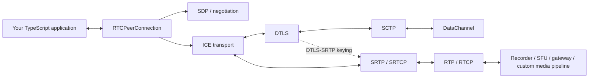

<div align="center">

# werift

### Programmable WebRTC for TypeScript & Node.js

Build media servers, gateways, recorders, bots, test peers, and custom real-time pipelines with a **browser-compatible WebRTC API** backed by a TypeScript stack you can inspect and extend down to **ICE, DTLS, SCTP, RTP/RTCP, SRTP/SRTCP, and DataChannel**.

[](https://www.npmjs.com/package/werift)
[](https://www.npmjs.com/package/werift)
[](./LICENSE)
[](https://www.npmjs.com/package/werift)
[](https://github.com/shinyoshiaki/werift-webrtc)

[Documentation](https://shinyoshiaki.github.io/werift-webrtc/website/build/) · [API Reference](https://shinyoshiaki.github.io/werift-webrtc/website/build/docs/api) · [Examples](./examples) · [Interoperability](#interoperability) · [Roadmap](#roadmap)

</div>

---

**werift** (**We**b**R**TC **I**mplementation **f**or **T**ypeScript) is a WebRTC implementation for Node.js written in TypeScript.

Use the browser-compatible `RTCPeerConnection` API when you want to build quickly, then drop down into ICE, DTLS, SCTP, RTP/RTCP, SRTP/SRTCP, or individual packets when your server-side application needs more control than a browser abstraction provides.

## Why werift?

- **Browser-compatible WebRTC API** — use familiar `RTCPeerConnection`, tracks, transceivers, DataChannels, standard events, ICE configuration, and stats in Node.js.
- **TypeScript from PeerConnection down to the protocols** — build and debug WebRTC without wrapping a native browser engine or native WebRTC binding.
- **Packet-oriented media control** — send and receive RTP directly, making werift a natural fit for SFUs, recorders, relays, gateways, bots, test peers, and custom media pipelines.
- **Modern server connectivity** — ICE-Lite, ICE restart, ICE-TCP, and TURN over UDP, TCP, and TLS are implemented in the TypeScript stack.
- **Modular protocol packages** — use the full PeerConnection stack or focused ICE, DTLS, SCTP, RTP, and STUN/TURN server packages.
- **Interoperability evidence at multiple levels** — Chromium-focused E2E coverage, a Firefox test runner, community-reported Safari interoperability, and independent `sipsorcery/webrtc-interop` matrices.
- **Inspectable and extensible** — instrument RTP/RTCP, experiment with congestion logic, inspect transport state, or modify protocol behavior without crossing a native boundary.

## Install

```bash
npm install werift
```

The published `werift` package currently declares Node.js 16 or newer in its package metadata.

## Quick start

The API follows the familiar browser WebRTC model:

```ts
import { RTCPeerConnection } from "werift";

const offerer = new RTCPeerConnection();
const answerer = new RTCPeerConnection();

answerer.ondatachannel = ({ channel }) => {
  channel.onmessage = ({ data }) => {
    console.log("answerer received:", data.toString());
    channel.send("hello from answerer");
  };
};

const channel = offerer.createDataChannel("chat");

channel.onopen = () => {
  channel.send("hello from offerer");
};

channel.onmessage = ({ data }) => {
  console.log("offerer received:", data.toString());
};

await offerer.setLocalDescription(await offerer.createOffer());
await answerer.setRemoteDescription(offerer.localDescription!);

await answerer.setLocalDescription(await answerer.createAnswer());
await offerer.setRemoteDescription(answerer.localDescription!);
```

Here the two peers exchange SDP directly. `setLocalDescription()` gathers candidates before resolving, so this compact example can exchange the resulting descriptions without a separate trickle-ICE signaling path. Real applications can also use `onicecandidate` / `addIceCandidate()` and move signaling to WebSocket, HTTP, SIP infrastructure, a queue, or another transport.

See [`examples/datachannel`](./examples/datachannel) for runnable variants.

## Browser-compatible WebRTC API

werift exposes a browser-compatible WebRTC API for normal application code, including PeerConnection negotiation, tracks/transceivers, DataChannels, standard events, ICE configuration, and `getStats()`.

A small number of intentional or known edge-case differences remain for backward compatibility or unsupported legacy APIs. They are documented separately in [Browser API compatibility](./docs/browser-api-compatibility.md), together with the WPT strategy used to track exact browser behavior.

## A WebRTC stack that stays programmable

The core media APIs are packet-oriented: `MediaStreamTrack` can receive and emit RTP, so applications can connect WebRTC directly to an RTP router, recorder, transcoder, media pipeline, or test harness.

werift does not provide operating-system camera/microphone capture as part of the core PeerConnection API. Import `werift/polyfill` and call `installPolyfill({ mediaRegister })` to install browser WebRTC globals and `navigator.mediaDevices.getUserMedia` backed by MP4/WebM, RTP/RTCP, encoded-binary, or custom registers. The nonstandard `getUserMedia({ path })` helper has been removed.

On Node.js, `installPolyfill({ mediaRegister })` also fills in a Chromium-compatible `navigator.userAgent` when the current value is missing or `Node.js/<major>`. Existing non-Node User-Agents are left unchanged unless you pass `userAgent` to overwrite them. Uninstall restores the previous descriptor. This is Node compatibility only; it does not claim that werift is a complete Chromium. `mediaRegister` remains an application responsibility.

```ts
import {
  createCallbackRegister,
  installPolyfill,
} from "werift/polyfill";

const uninstall = installPolyfill({
  mediaRegister: [
    createCallbackRegister({
      mimeType: "audio/opus",
      kinds: ["audio"],
      async createTracks() {
        return [createAudioTrack()];
      },
    }),
  ],
});

const stream = await navigator.mediaDevices.getUserMedia({ audio: true });
uninstall();
```

Passing an explicit `userAgent` replaces even a real browser or sandbox value; uninstall still restores the pre-install descriptor.

Node TypeScript without DOM (`lib: ["esnext"]`) gets werift constructor globals from `werift/polyfill`. Projects that include `lib.dom` should import `werift/polyfill/dom` so DOM constructors are left intact while `MediaStreamTrack.writeRtp` is still merged. `existingMediaDevices` defaults to `"overwrite"`; use `"throw"` or `"noop"` if you must not replace an existing `navigator.mediaDevices`. `existingMediaDevices: "noop"` still complements a missing/Node User-Agent.



DTLS and SRTP share the ICE transport, but media is **not tunneled through DTLS**: DTLS negotiates/exports keys for SRTP, while encrypted RTP/RTCP packets flow over the selected ICE path.

## Features

| Area | Highlights |
| --- | --- |
| **Browser API** | `RTCPeerConnection`, tracks/transceivers, DataChannel, standard events, ICE configuration, and browser-compatible negotiation behavior |
| **ICE** | Full ICE, local ICE-Lite mode, remote ICE-Lite interoperability, trickle ICE, ICE restart, ICE-TCP host candidates |
| **STUN / TURN** | STUN plus TURN relay control transports over UDP, TCP, and TLS; `turn:` / `turns:` URL handling |
| **Security** | DTLS-SRTP, SRTP, SRTCP, certificate/fingerprint handling |
| **DataChannel** | SCTP over DTLS, ordered/unordered delivery and partial-reliability controls |
| **RTP / RTCP** | RFC 3550, SR/RR, PLI, Generic NACK, REMB, Transport-Wide CC |
| **Media resilience** | RTX and RED (RFC 2198) |
| **RTP payloads** | RTP helpers for VP8, VP9, H.264, AV1, Opus, and RED-related workflows |
| **Simulcast** | Receive-side simulcast |
| **Bandwidth estimation** | Sender-side estimator driven by Transport-Wide CC feedback |
| **Statistics** | Browser-compatible `getStats()` report model for RTP, transport, ICE, codec, certificate, DataChannel, and related stats |
| **Recording** | Nonstandard `MediaRecorder` / WebM writer paths for Opus, VP8, VP9, H.264, and AV1 tracks |
| **Nonstandard media** | MP4/WebM file playback via mediabunny plus configurable/dummy media-device sources |
| **RTP processing** | Jitter buffer, RED encoder/decoder, DTX, NACK, lip sync, and other packet processors |

> werift's core strength is WebRTC transport, negotiation, and media-packet control. Device capture, rendering, and general-purpose transcoding remain application concerns; optional nonstandard helpers cover selected server-side media sources and sinks.

## What can you build?

### SFUs and RTP routers

Receive encoded RTP, inspect or transform it, then forward it to other peers without forcing your application through a browser-style media pipeline.

A separate SFU project built with werift is available at [node-sfu](https://github.com/shinyoshiaki/node-sfu).

### Recording and media ingestion

Record incoming WebRTC media or connect RTP to your existing storage/transcoding pipeline. See [`examples/save_to_disk`](./examples/save_to_disk) and the nonstandard recorder APIs.

### Gateways and protocol bridges

Use WebRTC as one side of a larger system: SIP/media gateways, device bridges, real-time backends, relay services, or application-specific transports.

### Automated WebRTC peers

Because the stack runs in Node.js and exposes packet/protocol state, it is useful for integration tests, interoperability suites, synthetic peers, load tests, and protocol debugging.

### Protocol experimentation

Use lower layers directly when you need custom ICE, DTLS, SCTP, RTP/RTCP, congestion-control, or packet-processing behavior.

## Modular packages

Use the PeerConnection stack or only the protocol layer you need.

| Package | Purpose |
| --- | --- |
| [`werift`](https://www.npmjs.com/package/werift) | Browser-compatible WebRTC API, media transport, DataChannel, and related APIs |
| [`werift-ice`](https://www.npmjs.com/package/werift-ice) | ICE / STUN / TURN client-side transport implementation |
| [`werift-dtls`](https://www.npmjs.com/package/werift-dtls) | DTLS implementation |
| [`werift-sctp`](https://www.npmjs.com/package/werift-sctp) | SCTP implementation |
| [`werift-rtp`](https://www.npmjs.com/package/werift-rtp) | RTP / RTCP / SRTP / SRTCP and RTP processing utilities |
| [`werift-ice-server`](https://www.npmjs.com/package/werift-ice-server) | RFC 8489 STUN / RFC 8656 TURN server stack and Node reference implementation |

The top-level `werift` package also exports lower-level WebRTC transport and RTP primitives, so applications can mix the browser-compatible API with packet-level control.

## Interoperability

Interoperability is validated at more than one level.

### Browser interoperability

The repository contains browser E2E tooling and Chromium-focused coverage, including scenarios for ICE-Lite, ICE-TCP, and TURN relay over UDP/TCP/TLS. A Firefox test runner is also included in the E2E workspace.

**Safari interoperability is community-verified.** Community users have reported using werift extensively with Safari; see [Issue #346](https://github.com/shinyoshiaki/werift-webrtc/issues/346). Safari is not currently part of the repository's automated browser E2E matrix, so this is presented as community validation rather than a CI guarantee.

### Cross-implementation matrix

werift is a participating implementation in [`sipsorcery/webrtc-interop`](https://github.com/sipsorcery/webrtc-interop), which maintains automated Peer Connection and Data Channel Echo tests. Its matrix includes werift alongside implementations such as:

- aiortc
- libdatachannel
- Pion
- SIPSorcery
- webrtc-rs

This provides an independent interoperability signal in addition to werift's own E2E tests.

## Examples

The [`examples`](./examples) directory contains runnable examples for high-level WebRTC use cases and lower-level media/protocol work.

| Example | What it demonstrates |
| --- | --- |
| [`examples/datachannel`](./examples/datachannel) | DataChannel offer/answer and messaging |
| [`examples/mediachannel`](./examples/mediachannel) | Sending and receiving WebRTC media (`installPolyfill` + `getUserMedia` for RTP ingest) |
| [`examples/save_to_disk`](./examples/save_to_disk) | Recording encoded WebRTC media |
| [`examples/turn-loopback`](./examples/turn-loopback) | HTTPS + TURN/TLS multiplexed loopback and Chromium E2E |
| [`examples/interop`](./examples/interop) | Interoperability-oriented peers and relay examples (`installPolyfill` for RTP ingest) |
| [`examples/getStats`](./examples/getStats) | `getStats()` example code |
| [`packages/rtp/src/extra/processor`](./packages/rtp/src/extra/processor) | Jitter buffering, RED, DTX, NACK, lip sync, and RTP processing utilities |

## Live demos

### MediaChannel

```bash
npm run media
```

Then open:

https://shinyoshiaki.github.io/werift-webrtc/examples/mediachannel/pubsub/answer

Use the browser console and `chrome://webrtc-internals/` to inspect the connection.

### DataChannel

```bash
npm run datachannel
```

Then open:

https://shinyoshiaki.github.io/werift-webrtc/examples/datachannel/answer

Again, the browser console and `chrome://webrtc-internals/` are useful for inspecting signaling, ICE, DTLS, SCTP, and DataChannel behavior.

## Debugging

werift uses the [`debug`](https://www.npmjs.com/package/debug) package throughout the stack.

```bash
DEBUG=werift* node your-app.js
```

For browser interoperability debugging, combine server logs with:

- `chrome://webrtc-internals/`
- SDP offer/answer dumps
- ICE candidate logs
- RTP/RTCP packet-level instrumentation

Because the implementation is TypeScript, protocol behavior can be traced directly from application-level events into the relevant transport and packet-processing code.

## Documentation

- [Documentation website](https://shinyoshiaki.github.io/werift-webrtc/website/build/)
- [API reference](https://shinyoshiaki.github.io/werift-webrtc/website/build/docs/api)
- [Examples](./examples)
- [Browser API compatibility differences](./docs/browser-api-compatibility.md)

Documentation coverage is still evolving. The examples and source remain useful references for developers working at protocol level.

## Repository setup

If you are contributing to werift itself, initialize the pinned upstream Web Platform Tests submodule before running the WPT compatibility tooling:

```bash
git submodule update --init --recursive
```

The repository-level package metadata declares Node.js 18 or newer. The opt-in memory-leak harness requires Node.js 24 or newer.

## Roadmap

### Towards 1.0

The core WebRTC transport, browser-compatible API, and media-packet stack are implemented. Current work towards 1.0 focuses on hardening, test coverage, and developer experience:

- [ ] Expand and improve documentation
- [ ] Increase Web Platform Tests coverage
- [ ] Continue strengthening unit, E2E, interoperability, and long-running reliability tests

### Towards 2.0

- [ ] Simulcast send support
- [ ] Additional cipher suites
- [ ] Richer WebRTC statistics coverage

## Protocol coverage at a glance

<details>
<summary>Implemented protocol/features checklist</summary>

- [x] Browser-compatible WebRTC API
- [x] STUN
- [x] TURN relay client
  - [x] UDP control transport
  - [x] TCP control transport
  - [x] TLS control transport (`turns:`)
- [x] STUN / TURN server package
  - [x] RFC 8489 STUN
  - [x] RFC 8656 TURN
  - [x] Node reference server
- [x] ICE
  - [x] Full ICE
  - [x] Trickle ICE
  - [x] Local ICE-Lite mode
  - [x] Remote ICE-Lite interoperability
  - [x] ICE restart
  - [x] ICE-TCP host candidates
- [x] DTLS
  - [x] DTLS-SRTP keying
- [x] DataChannel / SCTP
- [x] MediaChannel
  - [x] sendonly
  - [x] recvonly
  - [x] sendrecv
  - [x] multi-track
  - [x] RTX
  - [x] RED
- [x] RTP
  - [x] RFC 3550
  - [x] VP8 RTP helpers
  - [x] VP9 RTP helpers
  - [x] H.264 RTP helpers
  - [x] AV1 RTP helpers
  - [x] RED (RFC 2198)
- [x] RTCP
  - [x] SR/RR
  - [x] Picture Loss Indication
  - [x] Receiver Estimated Maximum Bitrate
  - [x] Generic NACK
  - [x] Transport-Wide CC
- [x] SRTP
- [x] SRTCP
- [x] SDP
  - [x] Reuse inactive m-lines
- [x] PeerConnection
- [x] Simulcast receive
- [x] Sender-side bandwidth estimation
- [x] Browser-compatible `getStats()` model
- [x] Nonstandard MediaRecorder workflows
  - [x] Opus
  - [x] VP8
  - [x] H.264
  - [x] VP9
  - [x] AV1
- [x] Nonstandard media helpers
  - [x] MP4/WebM file playback
  - [x] configurable/dummy media-device sources

</details>

## References

werift has benefited from the wider WebRTC implementation ecosystem, including:

- [aiortc](https://github.com/aiortc/aiortc)
- [Pion WebRTC](https://github.com/pion/webrtc)
- [sipsorcery/webrtc-interop](https://github.com/sipsorcery/webrtc-interop)

## License

MIT
