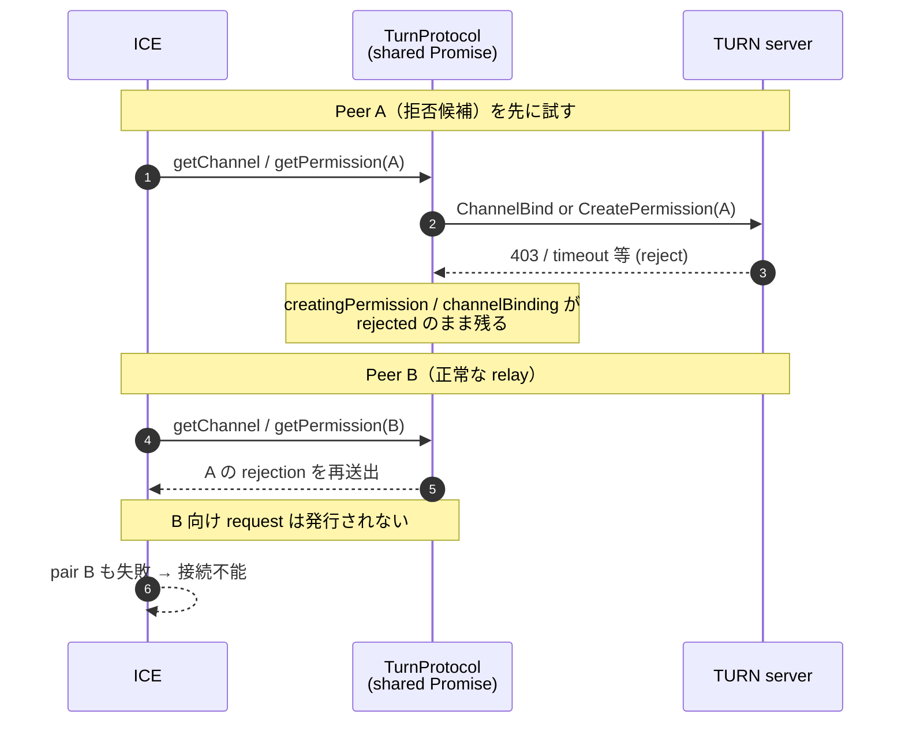
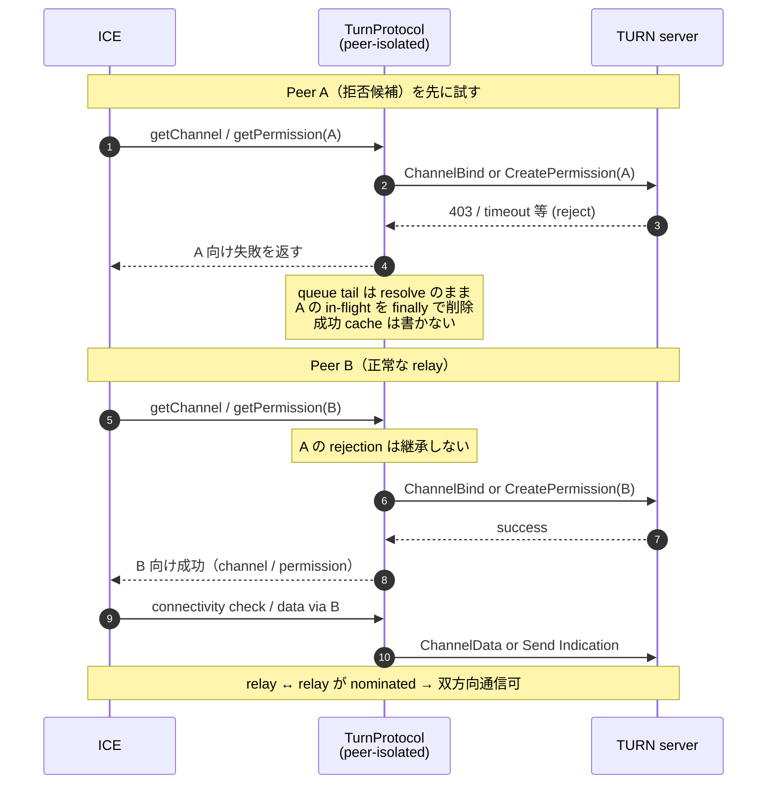

# Issue #667: TURN allocation 汚染の before / after

同一 TURN allocation 上で、ある peer 向け `CreatePermission` / `ChannelBind` が拒否されたあと、
別 peer 向けの後続操作がどうなるかをシーケンスで示す。

対象実装: `packages/ice/src/turn/protocol.ts`（`TurnProtocol`）

---

## 登場人物

| 略称 | 役割 |
|------|------|
| ICE | connectivity check（候補対を順に試す） |
| TP | `TurnProtocol`（同一 allocation を共有） |
| TURN | TURN サーバ |
| Peer A | 拒否される peer アドレス |
| Peer B | 正常な peer アドレス（例: 相手の relay 候補） |

---

## Before（汚染あり）

allocation 全体で 1 本の in-flight Promise（`creatingPermission` / `channelBinding`）を共有していた。

- Peer A の rejection が Promise に残る
- Peer B は `await` でその rejection を再送出する
- B 向け CreatePermission / ChannelBind に到達しない
- ICE では拒否候補が先に走ると、後続の `relay ↔ relay` まで全滅しうる

### Before の要点

1. **共有 Promise の poison**: 1 peer の失敗が allocation 全体に伝播
2. **成功前 cache**: permission を request 前に `true` にして retry を阻害
3. **ChannelBind 失敗時の mapping 残存**: 失敗後も「bind 済み」と誤認しうる
4. **refresh 期限の共有**: `channelRefreshAt` が allocation 全体

---

## After（peer 単位 isolation）

- allocation 共通: 直列 queue（`permissionQueue` / `channelBindQueue`）。**tail は常に resolve**し、rejection を次へ渡さない
- peer 固有: in-flight map + cache（Permission は **IP**、Channel は **IP+port**）
- cache は **成功後のみ**。初回 ChannelBind 失敗時は provisional mapping を rollback
- 失敗した channel number は再利用しない

### After の要点

1. **失敗は peer ローカル**: A reject → B は新規 transaction
2. **queue は直列だが非 poison**: 認証 state race を避けつつ次 peer を実行可能
3. **same-peer concurrent は 1 transaction**: in-flight map で dedupe
4. **retry 可能**: 失敗後に cache / provisional mapping が残らない

---

## 変化の対比（1 行）

| | Before | After |
|--|--------|--------|
| A 失敗後の B | 共有 rejected Promise で即失敗 | B 専用操作が実行され成功しうる |
| ICE 上の意味 | 拒否候補が先だと接続全滅しうる | 拒否候補の後でも valid relay で接続可 |

関連: `werift-issue-667-root-cause-and-fix.md`、試験は `packages/ice/tests/ice/turn-protocol-isolation.test.ts` および `turn.test.ts`（拒否 peer 先行 ICE）。
