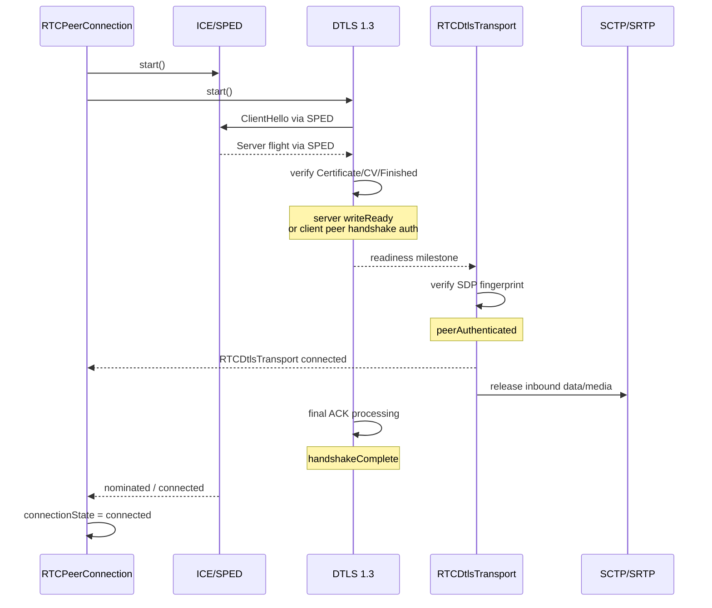
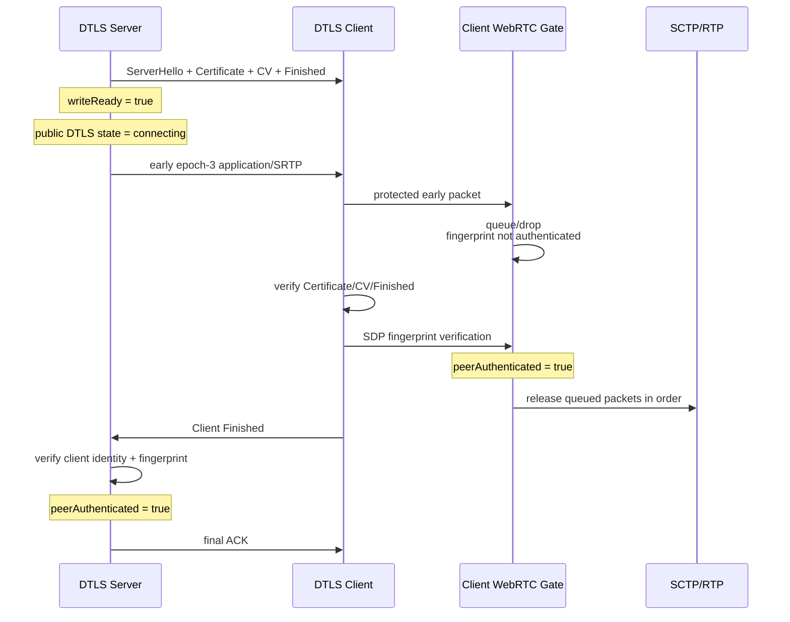
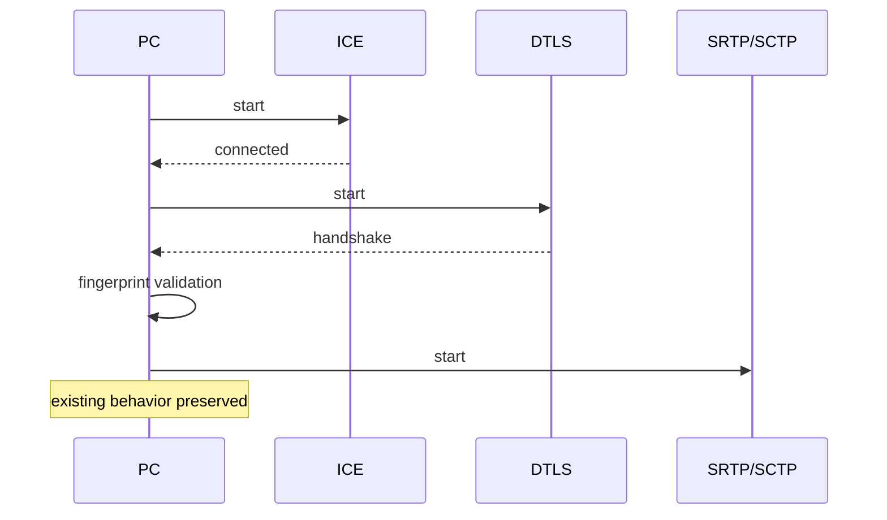

# Epic 4: WARP-enabled WebRTC transport 実装設計書

## 0. 前提

対象:

- Repository: `shinyoshiaki/werift-webrtc`
- Branch: `warp`
- 基準 commit: `9200f25512c656521e181ae5a3b49070ee4bfc65`
- Epic: Issue #659 / Epic 4
- Epic 1: DTLS 1.3 endpoint
- Epic 2: WebRTC DTLS 1.3 integration
- Epic 3: ICE/SPED carrier

Epic 4 では、Epic 2 の WebRTC DTLS 1.3 と Epic 3 の SPED を `RTCPeerConnection` レイヤーで統合し、

```text
ICE connectivity
        +
DTLS 1.3 handshake
```

を並行進行させる。

最終的には以下を成立させる。

```text
RTCPeerConnection
  ├─ ICE / SPED
  ├─ DTLS 1.3
  ├─ SDP fingerprint authentication
  ├─ DTLS-SRTP
  │    ├─ RTP
  │    └─ RTCP
  └─ SCTP
       └─ DataChannel
```

同時に、

- WARP 無効時
- DTLS 1.2
- DTLS 1.3 → 1.2 fallback
- Chromium の通常 WebRTC DTLS 1.3
- WARP を無効にした通常の TURN relay 経路
- ICE restart

を regression させない。

## 0.1 TURN relay のスコープ境界

**TURN relay 使用時の WARP は Epic 4 のスコープ外**とする。

relay candidate pair 上での SPED 搬送、WARP 接続成立、early traffic、direct DTLS carrier fallback の新規実装および相互接続検証は、いずれも完了条件に含めない。すでに存在する TURN relay 向け WARP/SPED 関連実装を削除する必要はない。

Epic 4 で TURN について求めるのは、`sped: false` の通常の WebRTC TURN relay 経路を回帰させないことだけである。

---

# 1. 現在の `warp` ブランチの実装評価

Epic 4 は未実装状態から始める必要はない。

既にかなりの基盤が存在しているため、既存コードを置き換えるのではなく、**readiness と authentication boundary を追加する方向**を採用する。

## 1.1 すでに実装済みの部分

### `RTCPeerConnection.connect()` の並列化

現在すでに `sped=true` では概ね以下になっている。

```ts
const dtlsPromise = dtlsTransport.start();
const icePromise =
  iceTransport.state === "connected"
    ? Promise.resolve()
    : iceTransport.start();

await Promise.all([icePromise, dtlsPromise]);
```

したがって Epic 4 の

```text
ICE → DTLS
```

から

```text
ICE ─┐
     ├─ parallel
DTLS ─┘
```

への基本変更はすでに入っている。

また、

```ts
private connectEpoch = 0;
```

により ICE restart 等で古い `connect()` が後から `connected` / `failed` を上書きする問題もある程度防止されている。

### SPED generation isolation

`packages/ice/src/sped/runtime.ts` は、

- ICE generation
- session epoch
- stale inject rejection
- restart 時の L1/L2 reset
- RTT reset
- MTU reset
- fallback
- carrier abort

をすでに持つ。

Epic 4 ではこの仕組みを維持する。

### DTLS 1.3 early key material

DTLS 1.3 server は Server Finished 送信後に、

```ts
this.writeEpoch = 3;
```

となる。

したがって cryptographic layer ではすでに server 0.5-RTT write が可能。

`Dtls13Connection.send()` も、

```ts
if (!this.connected && this.writeEpoch < 3) {
  throw ...
}
```

なので `writeEpoch >= 3` なら `connected=false` でも application data を送信できる。

### early application-data buffer

DTLS 1.3 には既に、

```ts
earlyAppData: Buffer[]
earlyAppDataBytes
maxEarlyAppDataRecords
maxEarlyAppDataBytes
```

がある。

現在の default:

```text
records = 256
bytes   = 256 KiB
```

である。

---

# 2. 現状実装で Epic 4 を満たしていない点

Epic 4 実装では特に以下を修正する必要がある。

## 2.1 `connected` が複数の意味を持っている

現在は概ね一つの `connected` に、

- application write key が生成された
- peer Finished を検証した
- peer certificate を検証した
- DTLS handshake の ACK が完了した
- WebRTC SDP fingerprint が一致した

という異なる状態が混在している。

これでは early send と WebRTC authentication を安全に両立できない。

---

## 2.2 SDP fingerprint 検証前に DTLS application data が漏れる可能性

現在の DTLS 1.3:

```text
markConnected()
  ↓
onConnect
  ↓
earlyAppData を onData へ flush
```

一方 `RTCDtlsTransport` は、

```text
DTLS onConnect
  ↓
start() が resume
  ↓
verifyRemoteCertificateFingerprint()
```

となっている。

JavaScript の Promise continuation よりも DTLS engine 内の同期 `onData` flush が先に走れるため、

```text
DTLS certificate / Finished verified
        ↓
DTLS onConnect
        ↓
early application data delivery
        ↓
SDP fingerprint verification
```

という順序が成立し得る。

これは Epic 4 の

> No application data or media is delivered before required fingerprint authentication.

に違反する。

**Epic 4 で最優先に修正する security boundary である。**

---

## 2.3 early buffer に retention time がない

現在は、

- record count
- bytes

のみ。

Epic 4 要件には、

```text
packet count
byte count
retention time
```

の3種類が要求されている。

---

## 2.4 SRTP が双方向一括 activation

現在:

```ts
updateSrtpSession();
startSrtp();
```

で local / remote key を同時に有効化する。

しかし Epic 4 では、

```text
outbound SRTP readiness
inbound SRTP readiness
```

を分離する必要がある。

---

## 2.5 SCTP start が DTLS full start 完了後

現在 `RTCPeerConnection.connect()` は、

```ts
await dtlsTransport.start();

await this.sctpManager.connectSctp();
```

なので server Finished 直後の early DataChannel は利用できない。

---

## 2.6 SCTP role が ICE role に依存している

現在:

```ts
private get isServer() {
  return this.dtlsTransport.iceTransport.role !== "controlling";
}
```

となっている。

通常の JSEP:

```text
offerer    ICE controlling / DTLS server
answerer   ICE controlled  / DTLS client
```

では偶然整合する。

しかし、

```text
answer: setup:passive
```

では、

```text
offerer  = DTLS client
answerer = DTLS server
```

となり ICE role と DTLS role の対応が逆転する。

DataChannel stream ID parity も DTLS role に依存するため、この coupling は Epic 4 で解消する。

---

## 2.7 `sped=true` の DTLS 1.2 fallback が不完全

現在の SPED handshake は、

```ts
spedHandshakeProtocolVersions(...)
```

で DTLS 1.3 のみに絞っている。

つまり、

```ts
protocolVersions: [
  DtlsVersion.V1_3,
  DtlsVersion.V1_2,
]
```

を設定していても、SPED path 自体は 1.3 のみで起動する。

Epic 4 では、

```text
SPED / DTLS 1.3 attempt
       ↓
1.3 unavailable
       ↓
ordinary direct DTLS 1.2
```

への安全な transition が必要。

---

# 3. 設計原則

Epic 4 では以下の4レイヤーを明確に分離する。

```text
┌───────────────────────────────────────┐
│ RTCPeerConnection                     │
│ connection orchestration              │
└───────────────────────────────────────┘
                  │
┌───────────────────────────────────────┐
│ RTCDtlsTransport                      │
│ WebRTC identity / SDP fingerprint     │
│ SRTP / SCTP release gate              │
└───────────────────────────────────────┘
                  │
┌───────────────────────────────────────┐
│ DtlsSocket / DTLS 1.3 association     │
│ cryptographic readiness               │
└───────────────────────────────────────┘
                  │
┌───────────────────────────────────────┐
│ ICE / SPED                            │
│ carrier / generation / nomination     │
└───────────────────────────────────────┘
```

重要なのは、

**DTLS の暗号学的認証完了と WebRTC peer authentication を同一視しないこと。**

SDP fingerprint は WebRTC layer の責務なので、generic DTLS engine へ SDP の概念を持ち込まない。

---

# 4. readiness state の導入

## 4.1 DTLS core

DTLS core では次の3状態を持つ。

```ts
interface DtlsReadiness {
  writeReady: boolean;
  peerHandshakeAuthenticated: boolean;
  handshakeComplete: boolean;
}
```

### `writeReady`

local application traffic key が利用可能。

### `peerHandshakeAuthenticated`

DTLS cryptographic layer で、

- peer Certificate
- CertificateVerify
- Finished

が検証済み。

SDP fingerprint は含めない。

### `handshakeComplete`

必要な final flight / ACK 処理まで終了。

---

## 4.2 WebRTC `RTCDtlsTransport`

WebRTC layer では、

```ts
interface WebRtcDtlsReadiness {
  writeReady: boolean;
  peerAuthenticated: boolean;
  handshakeComplete: boolean;
}
```

とする。

ここで、

```text
peerAuthenticated
 =
DTLS peerHandshakeAuthenticated
+
SDP fingerprint match
```

と定義する。

これが **DataChannel/RTP/RTCP inbound release boundary** となる。

---

# 5. readiness transition

## 5.1 DTLS server

```text
ClientHello
    ↓
ServerHello
Certificate
CertificateVerify
Finished
    ↓
epoch-3 write key installed
    ↓
writeReady = true
    │
    │ allowEarlyServerData=true の場合のみ
    └──── early outbound 可
    ↓
Client Certificate*
CertificateVerify*
Finished
    ↓
peerHandshakeAuthenticated = true
    ↓
SDP fingerprint validation
    ↓
peerAuthenticated = true
    ↓
RTCDtlsTransport.state = connected
    ↓
client Finished に対する ACK 完了
    ↓
handshakeComplete = true
```

server は `writeReady` と `peerAuthenticated` の間に 0.5-RTT window を持つ。

---

## 5.2 DTLS client

```text
Server Certificate
CertificateVerify
Finished
    ↓
DTLS cryptographic validation
    ↓
peerHandshakeAuthenticated = true
    ↓
SDP fingerprint validation
    ↓
peerAuthenticated = true
    ↓
Client Finished を送信
epoch-3 write key
    ↓
writeReady = true
    ↓
RTCDtlsTransport.state = connected
    ↓
server ACK
    ↓
handshakeComplete = true
```

実装上 fingerprint validation と client Finished の処理順を多少前後させてもよいが、

**application traffic の送信開始条件は fingerprint validation 済み**

とする。

したがって client は final ACK を待つ必要はないが、SDP fingerprint は必ず待つ。

---

# 6. public `RTCDtlsTransport.state` の定義

`connected` は、

```text
peerAuthenticated == true
```

になった時点で設定する。

`handshakeComplete` まで待たない。

理由:

- client の final ACK を待つと不要な RTT が増える
- Issue #659 が client write を final ACK 前に許可している
- authentication と loss-recovery completion は別概念

したがって、

```text
writeReady
     ≠
RTCDtlsTransport connected
     ≠
handshakeComplete
```

とする。

early server traffic 中も public state は、

```text
connecting
```

のまま。

---

# 7. `RTCDtlsTransport.start()` の contract

既存 API への影響を最小化するため、

```ts
await dtlsTransport.start();
```

は今後も

> WebRTC authentication が完了し、public transport が connected になった

時点で resolve する。

つまり内部の cryptographic `onConnect` を直接 resolve 条件にしない。

別途 internal API:

```ts
waitForWriteReady()
waitForPeerAuthenticated()
waitForHandshakeComplete()
```

を持たせる。

イベントだけでは subscribe 前に milestone を通過する race があるため、

```ts
if (alreadyReady) {
  return Promise.resolve();
}
return event.asPromise();
```

型の latch とする。

---

# 8. WARP startup orchestration

## 8.1 WARP disabled

現在の経路を変更しない。

```ts
await iceTransport.start();
await dtlsTransport.start();
await connectSctp();
```

```text
ICE nomination
   ↓
DTLS
   ↓
fingerprint
   ↓
SRTP/SCTP
```

DTLS 1.2 default もこの経路。

---

## 8.2 WARP enabled

概念コード:

```ts
const attempt = dtlsTransport.currentAttempt();

const dtlsAuthenticated = dtlsTransport.start();

const iceConnected =
  iceTransport.state === "connected"
    ? Promise.resolve()
    : iceTransport.start();

const earlyTraffic = startEarlyTrafficIfAllowed(
  dtlsTransport,
  attempt,
);

await Promise.all([
  iceConnected,
  dtlsAuthenticated,
]);

if (!attempt.isCurrent()) {
  return;
}

await ensureSctpStarted();

setPeerConnectionConnected();
```

重要:

`RTCPeerConnection.connectionState = connected` は、

```text
ICE connected
AND
DTLS peerAuthenticated
```

の双方が成立してから。

---

# 9. WARP handshake の開始条件

DTLS flight 1 は以下がすべて揃った時だけ生成する。

```text
local certificate
remote SDP fingerprint
remote ICE username fragment
remote ICE password
DTLS role
SDP answer
```

`RTCDtlsTransport` に例えば、

```ts
assertWarpStartReady()
```

を設けてもよい。

特に、

```text
offerer == DTLS client
```

という仮定は禁止する。

---

# 10. JSEP role mapping

以下の両方を E2E で成立させる。

## answer `setup:active`

```text
offerer  = DTLS server
answerer = DTLS client
```

## answer `setup:passive`

```text
offerer  = DTLS client
answerer = DTLS server
```

ICE controlling/controlled は別軸として扱う。

```text
DTLS role ≠ ICE role
```

を設計上の invariant とする。

---

# 11. DTLS core の milestone 実装位置

## server `writeReady`

`flight/server/flight4.ts` の、

```ts
await this.sendHandshakeFlight(...);

this.localFinishedSent = true;
this.writeEpoch = 3;
```

の後。

条件:

```text
server Finished の flight が carrier に渡された
AND
epoch-3 write key が installed
```

ここで、

```ts
markWriteReady()
```

する。

---

## client `peerHandshakeAuthenticated`

`flight/client/flight5.ts` で、

- server Certificate
- CertificateVerify
- Finished

検証後。

---

## client `writeReady`

client Finished の flight が carrier に渡され、

```ts
writeEpoch = 3
```

になった時点。

---

## server `peerHandshakeAuthenticated`

`flight/server/flight5.ts` の client Finished 検証成功後。

---

## client `handshakeComplete`

final client flight の pending records が server ACK により全て clear された時。

`record-rx.ts` の ACK handling で判定する。

---

## server `handshakeComplete`

client Finished を受理し、その record を含む ACK の送信が成功した後。

現在は `markConnected()` が Finished handler 内にあるため、

```text
Finished validation
↓
markConnected
↓
record-rx
↓
ACK
```

となっている。

`handshakeComplete` は最後の ACK 完了後に発火させる。

---

# 12. `connected` backward compatibility

generic `DtlsSocket.connected` は直ちに削除しない。

内部的には、

```text
connected ≒ peerHandshakeAuthenticated
```

の compatibility view とする。

新しい code は boolean `connected` を readiness 判定に使用しない。

---

# 13. WebRTC application-data authentication gate

## 現状

```ts
dtls.onData.subscribe((buf) => {
  this.dataReceiver(buf);
});
```

をやめる。

## 新設

`RTCDtlsTransport` 内に、

```text
InboundApplicationGate
```

を設ける。

```text
DTLS protected application data
          ↓
InboundApplicationGate
          │
          ├─ peerAuthenticated=false
          │      → bounded queue
          │
          └─ peerAuthenticated=true
                 → SCTP dataReceiver
```

SDP fingerprint match 後のみ、

```ts
applicationGate.authenticate();
```

して queue を drain する。

fingerprint mismatch:

```ts
applicationGate.abort("fingerprint-mismatch");
```

として一件も上位へ配送しない。

---

# 14. early application-data buffer

既存の DTLS 1.3 buffer を拡張する。

## limit

初期値は既存値を維持する。

```text
max records = 256
max bytes   = 256 KiB
retention   = 2 seconds
```

retention は新設。

値は定数として開始し、必要なら後から tuning する。

## overflow

古い packet を追い出して新 packet を入れる方式にはしない。

```text
queue full
   ↓
new record drop
```

とする。

理由:

ordered application stream で古い packet を消して後続を配送すると ordering semantics が崩れるため。

SCTP 自体が reliable retransmission するため、DTLS record の drop は後から回復可能。

## timeout

queue の head が retention time を超えた場合は queue 全体を破棄する。

```text
head expired
    ↓
entire queue discard
```

これにより古い packet を欠落させた状態で後続だけを配送しない。

handshake 自体は timeout だけで failure にしない。

---

# 15. queue cleanup

以下すべてで early queue を破棄する。

- SDP fingerprint mismatch
- invalid CertificateVerify
- invalid Finished
- DTLS fatal alert
- close
- SPED fallback transition
- ICE restart during incomplete handshake
- generation change
- timeout

---

# 16. explicit early server data option

early traffic は opt-in とする。

推奨 config:

```ts
warp?: {
  allowEarlyServerData?: boolean;
  earlyMediaPolicy?: "drop" | "buffer";
}
```

default:

```ts
warp: {
  allowEarlyServerData: false,
  earlyMediaPolicy: "drop",
}
```

既存 `sped` は carrier optimization の enable flag として維持する。

```ts
new RTCPeerConnection({
  sped: true,
  warp: {
    allowEarlyServerData: true,
  },
  dtls: {
    protocolVersions: [DtlsVersion.V1_3],
  },
});
```

制約:

```text
allowEarlyServerData
        requires
sped=true
AND DTLS 1.3
```

DTLS 1.2 fallback 時には early traffic を自動的に無効化する。

---

# 17. server early write gate

DTLS core の `writeReady` を、そのまま application send permission にしない。

WebRTC layer では、

```ts
canWriteApplication =
  peerAuthenticated ||
  (
    role === "server" &&
    allowEarlyServerData &&
    coreWriteReady
  );
```

とする。

これにより、

### Server

明示 opt-in 時のみ fingerprint validation 前に early outbound 可能。

### Client

server Finished の cryptographic validation だけでは送らず、

```text
SDP fingerprint validation
```

完了後に outbound を許可する。

---

# 18. SCTP / DataChannel

## 18.1 SCTP role と ICE role を分離

現在:

```ts
return iceTransport.role !== "controlling";
```

を廃止する。

Epic 4 では SCTP association initiation policy を、

```text
DTLS server → SCTP active initiator
DTLS client → SCTP passive
```

とする。

これは SCTP protocol requirement ではなく、WARP の early server data を両 JSEP role mapping で実現するための werift orchestration policy。

既存の通常ケース:

```text
offerer = DTLS server
```

では現在と同じ側が INIT を送るため挙動は維持される。

`setup:passive` の場合のみ正しく役割が反転する。

---

## 18.2 DataChannel stream ID parity

stream ID は必ず DTLS role から決定する。

```text
DTLS client → even
DTLS server → odd
```

ICE controlling/controlled を使用しない。

---

## 18.3 early SCTP start

DTLS server:

```text
DTLS writeReady
    ↓
allowEarlyServerData ?
    ↓ yes
SCTP INIT
```

DTLS client 側では early INIT が application gate に溜まる可能性がある。

fingerprint authentication 完了後に gate を開き、SCTP へ ordered delivery する。

SCTP passive side は gate drain より前に受信可能状態へ arm しておく。

---

## 18.4 `connectPromise`

現在の:

```ts
private connectPromise?: Promise<void>;
```

は失敗すると永久に rejected promise が残る可能性がある。

Epic 4 では、

```ts
try {
  await ...
} catch (e) {
  this.connectPromise = undefined;
  throw e;
}
```

とし、fallback/restart 後の retry を許可する。

---

# 19. DTLS-SRTP directional readiness

## 現状

`updateSrtpSession()` で両方向を同時に install している。

## 新設 state

```ts
private srtpKeysInstalled = false;
private srtpWriteReady = false;
private srtpReadReady = false;
```

key material 自体は exporter 利用可能になったら一度だけ生成してよい。

重要なのは **session object の存在ではなく利用 permission を分離すること**。

---

# 20. outbound SRTP

```ts
canWriteSrtp =
  peerAuthenticated ||
  (
    role === "server" &&
    allowEarlyServerData &&
    writeReady
  );
```

server early mode では Server Finished 後に、

```text
SRTP outbound
SRTCP outbound
```

を許可する。

public DTLS state はまだ `connecting`。

---

# 21. inbound SRTP

fingerprint authentication 前には絶対に、

```text
onRtp
onRtcp
```

を発火させない。

現在の `startSrtp()` 内で ICE listener を後から追加する構造を変更し、

**media demux listener 自体は早期に一度だけ登録**する。

```text
ICE packet
   ↓
isMedia()
   ↓
srtpReadReady ?
 ├─ yes → decrypt → deliver
 └─ no
      ├─ buffer policy → encrypted packet queue
      └─ drop policy   → drop + stats
```

encrypted SRTP のまま buffer し、

```text
fingerprint authentication
        ↓
srtpReadReady
        ↓
decrypt
        ↓
RTP/RTCP delivery
```

とする。

これにより fingerprint 前に復号済み media を上位へ公開しない。

---

# 22. early media policy

default は、

```text
drop
```

を推奨する。

理由:

- RTP は packet loss を許容する
- pre-auth memory 使用量を減らせる
- implementation complexity が小さい

ただし Epic 4 test 用および必要なユースケース向けに、

```text
buffer
```

も実装する。

buffer 時:

```text
packets    <= 256
bytes      <= 256 KiB
retention  <= 2 sec
```

とする。

---

# 23. central demultiplexing

Epic 4 で、

```text
STUN
DTLS
RTP
RTCP
```

の分類経路を別々に作らない。

既存の central demux を維持し、その後段に readiness gate を追加する。

```text
UDP/TURN
   ↓
ICE
   ↓
central classification
   ├─ STUN → ICE/SPED
   ├─ DTLS → DTLS
   └─ media
        ↓
      SRTP gate
```

---

# 24. SPED と DTLS 1.2 fallback

これは Epic 4 の重要変更点。

現在の、

```ts
spedHandshakeProtocolVersions()
```

によって SPED association が DTLS 1.3 only に固定される構造を解消する。

## 目標

```text
[V1_3, V1_2]
      ↓
1.3 candidate:
  SPED carrier
      ↓
peer 1.3 capable?
 ├─ yes → WARP DTLS 1.3
 └─ no
      ↓
disable SPED
      ↓
ordinary direct DTLS 1.2
```

---

# 25. association-level carrier integration

SPED carrier を、

```text
DTLS 1.3 engine 専用 socket
```

として扱うのではなく、

```text
DTLS association の 1.3 candidate に挿入される carrier
```

として扱う。

つまり dual-stack DtlsSocket が version selection の ownership を持つ。

```text
DtlsSocket
  ├─ DTLS 1.3 candidate → SPED carrier
  └─ DTLS 1.2 candidate → ordinary direct transport
```

1.2 commit 後:

```text
SPED L1/L2 abort
carrier timers cancel
early queues clear
early traffic disabled
```

して legacy path へ移る。

DTLS 1.2 の既存 handshake state machine 自体には WARP semantics を持ち込まない。

---

# 26. non-SPED direct fallback

peer が SPED 非対応の場合、

Epic 3 の invariant:

> exact same serialized flight

を維持する。

```text
ClientHello serialized once
        ↓
SPED L1
        ↓
SPED unavailable
        ↓
same Buffer
        ↓
direct DTLS datagram
```

re-serialize しない。

---

# 27. ICE restart

## 27.1 二重の generation guard

既存:

```text
RTCPeerConnection.connectEpoch
```

に加え、

`RTCDtlsTransport` でも、

```ts
transportAttemptId
iceGeneration
```

を保持する。

```ts
interface TransportAttempt {
  id: number;
  iceGeneration: number;
}
```

すべての async readiness callback で、

```ts
if (!isCurrentAttempt(attempt)) {
  return;
}
```

を行う。

---

## 27.2 restart during handshake

```text
ICE generation N
  WARP handshake in progress
        ↓
ICE restart
        ↓
generation N queues discarded
        ↓
SPED runtime reset(N+1)
        ↓
stale injected packet rejected
        ↓
new generation probing
```

以下を clear:

- application early buffer
- early media buffer
- pending upper-layer readiness notification
- old generation diagnostics

Epic 3 の SPED flight reseed は利用する。

---

## 27.3 restart after authenticated DTLS

既に、

```text
peerAuthenticated=true
```

なら DTLS/SCTP association を不用意に作り直さない。

```text
existing DTLS/SCTP
      +
new ICE generation
```

として、新しい candidate pair の接続完了を待つ。

early queue は存在しないため security boundary は維持される。

---

# 28. failure semantics

| Failure | 処理 |
|---|---|
| fingerprint mismatch | DTLS failed、全 early buffer clear、SPED abort、SCTP/media delivery禁止 |
| invalid CertificateVerify | DTLS fatal、buffer clear |
| invalid Finished | DTLS fatal、buffer clear |
| app queue overflow | newest record drop、handshake継続 |
| app queue timeout | queue全破棄、handshake継続 |
| media overflow | packet drop |
| SPED unsupported | exact-flight direct fallback |
| DTLS 1.2 selected | SPED/early無効化して legacy path |
| ICE restart during handshake | old generation discard |
| close during handshake | timers / carrier / queues 全停止 |
| final ACK loss | public connected 維持、handshakeComplete=false、retransmit継続 |

---

# 29. Stats

既存の、

```text
tlsVersion
dtlsCipher
srtpCipher
selectedCandidatePairId
iceRestarts
```

は維持する。

Epic 4 独自 field は将来の W3C field と衝突しないよう `warp*` prefix を推奨する。

```ts
interface RTCTransportStats {
  // existing
  tlsVersion?: string;
  dtlsCipher?: string;
  srtpCipher?: string;

  // WARP diagnostics
  warpSpedState?:
    | "disabled"
    | "probing"
    | "active"
    | "fallback";

  warpCarrier?: "direct" | "sped";

  warpHandshakeRttMs?: number;

  warpDtlsRetransmissions?: number;
  warpSpedRetransmissions?: number;

  warpEarlyBufferedPackets?: number;
  warpEarlyBufferedBytes?: number;

  warpEarlyDroppedPackets?: number;
  warpEarlyDroppedBytes?: number;

  warpEarlyServerSendUsed?: boolean;

  iceGeneration?: number;
}
```

---

# 30. retransmission stats

現在 DTLS 1.3 の `retransmitCount` は pending flight clear 時に reset される。

stats 用に cumulative:

```ts
totalRetransmitCount
```

を追加する。

```text
retransmitCount       = current flight
totalRetransmitCount  = association lifetime
```

SPED runtime にも同様の cumulative counter を追加する。

---

# 31. handshake RTT

定義を曖昧にしない。

```text
warpHandshakeRttMs
 =
peerAuthenticatedAt
-
handshakeStartedAt
```

とする。

ICE RTT と混同しない。

SPED path RTT は別途 carrier diagnostics として保持可能。

---

# 32. SPED diagnostics API

`SpedRuntime` 自体を WebRTC へ公開しない。

例えば、

```ts
interface SpedDiagnostics {
  state: "probing" | "active" | "fallback" | "disabled";
  retransmissions: number;
  carrier: "sped" | "direct";
}
```

という snapshot getter のみ internal に公開する。

---

# 33. 主な変更ファイル

## `packages/dtls`

### `src/engine/v1_3/connection-base.ts`

追加:

- readiness state
- milestone events/latches
- early queue timeout
- cumulative retransmission stats
- handshake timestamps

### `src/engine/v1_3/flight/server/flight4.ts`

追加:

```text
server writeReady
```

### `src/engine/v1_3/flight/server/flight5.ts`

追加:

```text
peerHandshakeAuthenticated
```

### `src/engine/v1_3/flight/client/flight5.ts`

追加:

```text
peerHandshakeAuthenticated
writeReady
```

### `src/engine/v1_3/record-rx.ts`

追加:

- final ACK → handshakeComplete
- early queue expiration
- cumulative retransmission/ACK diagnostics

### `src/engine/v1_3/types.ts`

追加:

- retention limit
- readiness type

### 新規候補

```text
src/engine/v1_3/readiness.ts
src/engine/v1_3/early-data-buffer.ts
```

---

## `packages/dtls/src/socket.ts`

追加:

```ts
waitForWriteReady()
waitForPeerHandshakeAuthenticated()
waitForHandshakeComplete()
```

DTLS 1.3 engine milestone を association layer へ bridge。

`onConnect` は backward-compatible event として残す。

dual stack/SPED integration もここを ownership boundary とする。

---

# 34. `packages/webrtc`

## `src/transport/dtls.ts`

Epic 4 の中心。

追加:

- WebRTC readiness state
- SDP fingerprint authentication gate
- application-data gate
- directional SRTP readiness
- early media buffer/drop
- ICE generation/attempt guard
- WARP diagnostics
- early send permission

`completeHandshake()` は概念的に、

```text
start DTLS
   ↓
peerHandshakeAuthenticated
   ↓
verify SDP fingerprint
   ↓
peerAuthenticated
   ↓
public connected
```

へ変更する。

---

## `src/peerConnection.ts`

既存 parallel startup をベースに、

- readiness-based connection completion
- early SCTP orchestration
- stale attempt rejection

を追加する。

serial branch は変更しない。

---

## `src/secureTransportManager.ts`

追加 config を `RTCDtlsTransport` へ狭く伝播する。

`PeerConfig` 全体を transport へ渡さない。

---

## `src/transport/sctp.ts`

修正:

- ICE role 依存の SCTP role を廃止
- DTLS role ベースへ変更
- DataChannel stream parity 修正
- early active/passive start

---

## `src/sctpManager.ts`

修正:

- early SCTP start
- retry-safe `connectPromise`
- failed/fallback attempt reset

---

## `src/media/stats.ts`

WARP optional stats 追加。

---

# 35. `packages/ice`

Epic 3 protocol semantics は基本変更しない。

必要な追加は diagnostics と WebRTC lifecycle callback に限定する。

候補:

```text
src/sped/runtime.ts
```

追加:

- cumulative retransmission count
- carrier state snapshot
- generation reset notification

SPED wire formatや authentication boundary は Epic 4 で変更しない。

---

# 36. WARP connection sequence



---

# 37. early server sequence



---

# 38. WARP-disabled sequence



---

# 39. unit tests

## DTLS readiness

追加:

```text
server writeReady occurs after local Finished
server writeReady occurs before client Finished

client peerHandshakeAuthenticated after server Finished
client writeReady after final client flight

server peerHandshakeAuthenticated after client Finished

client handshakeComplete only after final ACK
server handshakeComplete only after final ACK TX
```

さらに、

```text
writeReady
→ peerAuthenticated
→ handshakeComplete
```

の milestone が一方向にしか遷移しないこと。

---

# 40. fingerprint security tests

必須:

```text
early app packet arrives
↓
DTLS crypto auth succeeds
↓
SDP fingerprint mismatch
↓
no DataChannel message event
```

同様に RTP/RTCP。

明示的に、

```ts
expect(receivedApplicationData).toHaveLength(0);
expect(receivedRtp).toHaveLength(0);
expect(receivedRtcp).toHaveLength(0);
```

を確認する。

---

# 41. early buffer tests

### app data

- records limit
- byte limit
- retention timeout
- exact ordering
- overflow
- timeout
- authentication failure cleanup
- close cleanup
- ICE restart cleanup

### media

- drop policy
- buffer policy
- packet limit
- byte limit
- timeout
- authentication failure

---

# 42. RTCPeerConnection E2E

2つの実際の `RTCPeerConnection` を使う。

最低限以下を parameterize する。

| DTLS role | ICE | SPED | Version |
|---|---|---|---|
| setup active | Full×Full | on | 1.3 |
| setup passive | Full×Full | on | 1.3 |
| setup active | Full×Lite | on | 1.3 |
| setup passive | Full×Lite | on | 1.3 |
| active | Full×Full | off | 1.3 |
| passive | Full×Full | off | 1.3 |
| active | Full×Full | on | 1.3→1.2 |
| passive | Full×Full | on | 1.3→1.2 |

---

# 43. DataChannel E2E

全 role mapping で、

- open
- bidirectional text
- binary
- multiple messages
- ordering

を確認。

early mode:

```text
server sends before peerAuthenticated
↓
client must not expose before fingerprint
↓
fingerprint success
↓
message delivered
```

early disabled:

```text
writeReady
↓
send blocked/queued
↓
peerAuthenticated
↓
normal send
```

---

# 44. RTP / RTCP E2E

確認:

- RTP bidirectional
- RTCP bidirectional
- DTLS client write key = DTLS server read key
- DTLS server write key = DTLS client read key
- SRTP auth tag failure drop
- replay rejection
- sequence rollover
- ROC
- early server RTP
- early server RTCP
- fingerprint before delivery

---

# 45. ICE restart E2E

handshake 中の restart:

```text
generation N SPED data
restart
generation N+1
old SPED packet replay
```

で、

```text
old packet ignored
no stale DataChannel
no stale media
no stale readiness transition
```

を確認。

接続後 restart:

```text
DTLS/SCTP remains usable
new selected candidate pair
ICE generation increment
```

を確認する。

---

# 46. TURN（通常経路の非回帰のみ）

TURN relay 使用時の WARP は Epic 4 のスコープ外とする。したがって、relay pair 上の SPED embedding、WARP 接続、early traffic、direct DTLS carrier fallback は、新規実装・相互接続検証・完了判定の対象にしない。既存の関連実装は削除しなくてよい。

TURN に関する必須確認は、次の通常経路を回帰させないことに限定する。

```text
sped=false
↓
relay pair selected
↓
ordinary DTLS/SRTP/SCTP
```

---

# 47. Pion interoperability

Epic 3 の Pion harness を流用する。

必須:

- werift controlling × Pion controlled
- Pion controlling × werift controlled
- Full ICE
- ICE Lite
- SPED DATA/ACK
- nomination before DTLS completion
- direct fallback
- ICE restart
- old generation rejection
- direct path

Epic 4 では単なる attribute codec ではなく、WebRTC transport orchestration まで確認する。
TURN relay 上の WARP/SPED orchestration はこの相互接続要件に含めない。

---

# 48. BoringSSL

既存の BoringSSL DTLS 1.3 infrastructure を利用する。

確認:

- client/server
- direct DTLS
- Pion SPED carrier
- CertificateVerify
- Finished
- application data
- exporter
- KeyUpdate
- protocol mismatch
- malformed/invalid CertificateVerify
- invalid Finished

特に exporter は DTLS-SRTP key direction 検証にも使用する。

---

# 49. OpenSSL DTLS 1.2 regression

Epic 4 の変更で legacy path を壊さないこと。

- client/server
- DTLS 1.2 only
- `[1.3, 1.2] → 1.2`
- SRTP exporter
- DataChannel
- RTP
- RTCP
- WARP disabled

---

# 50. Chromium regression

Epic 2 の Chromium suite は変更せず維持する。

Chromium では、

```text
SPED = disabled
```

でよい。

目的は、

```text
WARP implementation
    ↓
ordinary WebRTC DTLS 1.3 regression
```

を検出すること。

現在の、

```text
DTLS 1.2 → FEFD
DTLS 1.3 → FEFC
```

assertion も維持する。

---

# 51. 推奨実装順

## Step 1 — DTLS readiness

最初に transport optimization を入れず、

- writeReady
- peerHandshakeAuthenticated
- handshakeComplete

を追加。

既存 DTLS tests を全て green にする。

---

## Step 2 — fingerprint gate

`RTCDtlsTransport` に application gate を追加。

この時点で、

> fingerprint 前に application data が一切漏れない

状態を作る。

early send はまだ有効化しない。

---

## Step 3 — directional SRTP

- SRTP key installation
- write permission
- read permission
- media buffer/drop

を分離。

通常接続の結果が変わらないことを確認。

---

## Step 4 — SCTP role correction

ICE role dependency を除去。

- setup active
- setup passive

の両方で DataChannel を成立させる。

---

## Step 5 — WARP early server traffic

`allowEarlyServerData` を実装。

server `writeReady` から、

- SCTP
- RTP
- RTCP

の early outbound を許可。

---

## Step 6 — DTLS 1.2 fallback

SPED carrier と dual-stack association を統合し、

```text
1.3/SPED
→
1.2/direct
```

transition を完成させる。

---

## Step 7 — generation isolation

上位 WebRTC queue/readiness に、

- ICE generation
- transport attempt

を伝播。

restart race tests を追加。

---

## Step 8 — Stats

最後に diagnostics を追加。

stats が protocol state を変更しないよう read-only snapshot とする。

---

## Step 9 — interoperability

- werift
- Pion
- BoringSSL
- OpenSSL
- Chromium

を実行。

---

# 52. 実装時に維持する invariant

Epic 4 のレビューでは以下を invariant として確認する。

### Security

```text
peerAuthenticated=false
→ no inbound DataChannel event
→ no inbound RTP event
→ no inbound RTCP event
```

### Early server traffic

```text
public RTCDtlsTransport.state=connecting
```

でも early outbound は可能だが、明示 opt-in の server のみ。

### Client

```text
SDP fingerprint validated
```

前に application/media を送信しない。

### Generation

```text
generation N packet
```

が generation N+1 の、

- readiness
- queue
- DTLS
- SCTP
- media

へ影響しない。

### Fallback

```text
DTLS 1.2
```

には WARP early semantics を持ち込まない。

### Default

```text
sped=false
dtls={}
```

の挙動は変更しない。

---

# 53. Epic 4 completion criteria と実装対応

| Issue #659 criteria | 実装 |
|---|---|
| SPED + DTLS1.3 in both JSEP roles | role-independent startup + SCTP role修正 |
| DataChannel bidirectional | SCTP readiness/gate |
| RTP/RTCP bidirectional | directional SRTP |
| SRTP keys correct direction | DTLS role based exporter test |
| Pion SPED interop | Epic3 harness拡張 |
| BoringSSL interop | carrier + endpoint harness |
| OpenSSL 1.2 compatibility | dual-stack fallback |
| Chromium regression | Epic2 suite維持 |
| no app before fingerprint | InboundApplicationGate |
| no media before fingerprint | SRTP read gate |
| early server does not set connected | readiness separation |
| WARP-disabled unchanged | serial branch維持 |
| ICE restart isolation | attempt + generation guard |
| ordinary TURN regression | `sped: false` の既存 relay 経路を維持 |

---

# 54. 最も重要なレビュー観点

Epic 4 の実装で特にレビューすべき箇所は次の5点。

1. **DTLS `onConnect` を WebRTC authentication と誤認していないか**
2. **fingerprint validation 前に `onData` / `onRtp` / `onRtcp` が一件でも発火し得ないか**
3. **SCTP/DataChannel role を ICE controlling/controlled から決めていないか**
4. **`sped=true` + `[1.3,1.2]` が実質 1.3-only になっていないか**
5. **ICE restart 後に旧 generation の async callback が readiness を更新できないか**

この5項目を満たさない実装は、接続テストが成功していても Epic 4 完了とはしない。

---

# 55. 結論

現在の `warp` には、

- DTLS 1.3
- SPED
- ICE generation isolation
- parallel `ICE + DTLS`
- epoch-3 early keys
- bounded early data
- DTLS-SRTP
- Chromium interoperability

までかなりの基盤が既に存在する。

したがって Epic 4 では大規模な transport 再実装は不要。

中心となる変更は、

```text
1. DTLS readiness を3段階へ分離
2. SDP fingerprint を WebRTC の絶対的な inbound release boundary にする
3. server 0.5-RTT outbound を明示 opt-in で有効化
4. SRTP read/write readiness を分離
5. SCTP role を ICE role から分離
6. SPED + DTLS 1.2 fallback を association level で完成
7. WebRTC layer にも ICE generation isolation を適用
```

の7点である。

特に、現在存在する

```text
DTLS onConnect
→ early onData flush
→ SDP fingerprint verification
```

という潜在的順序を、

```text
DTLS cryptographic authentication
→ WebRTC SDP fingerprint authentication
→ application/media release
```

へ変更することを Epic 4 の最重要 security requirement とする。
