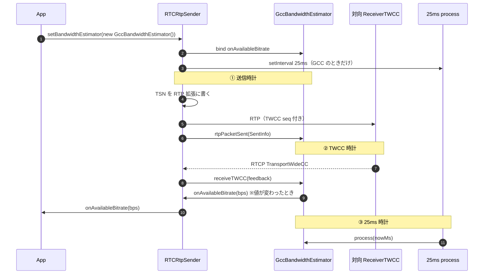
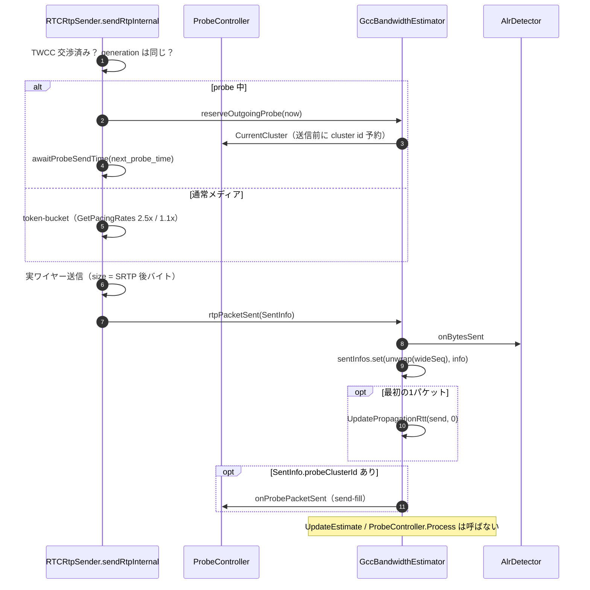
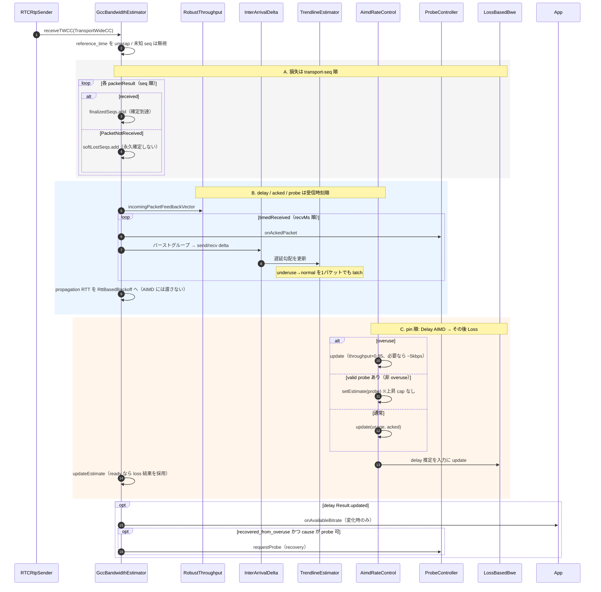
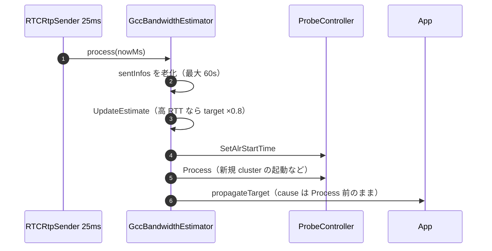
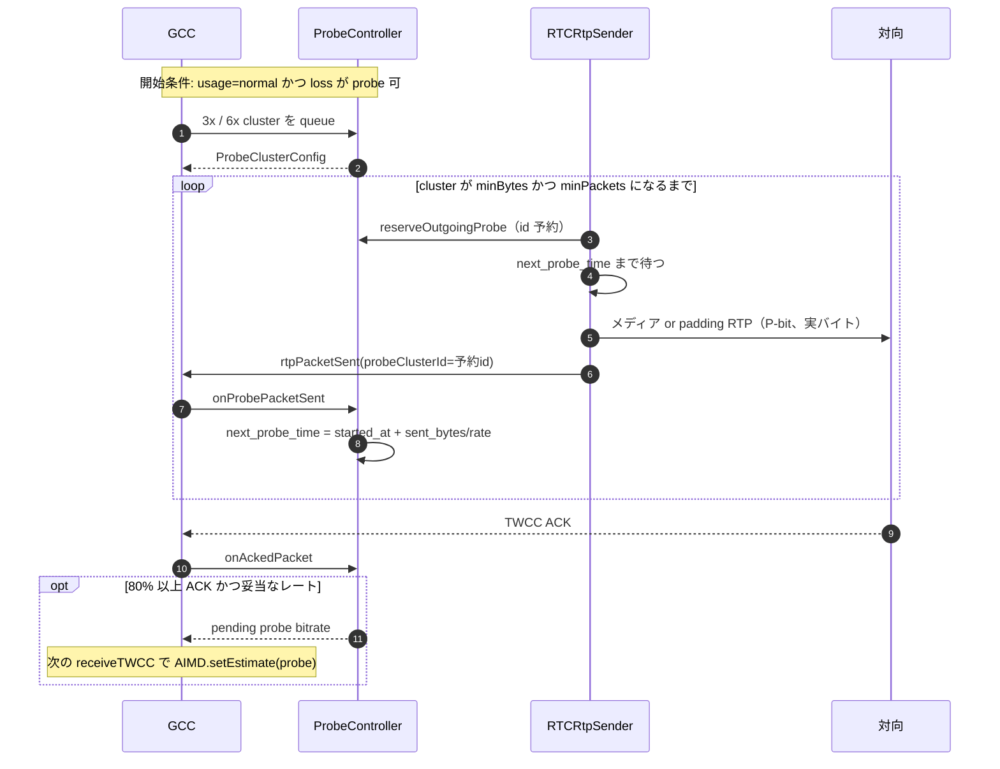
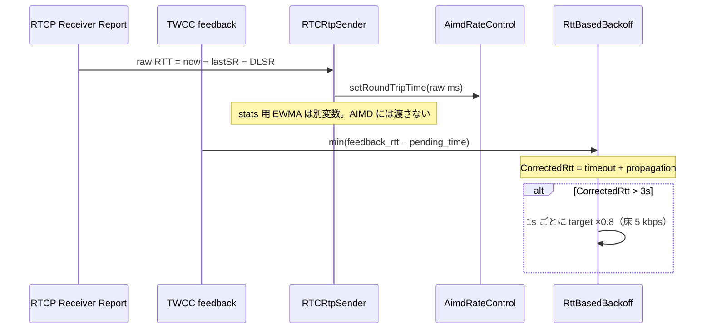

---
ide:
  viewer: review-document
  version: 1
  title: "GCC の仕組み — シーケンスと実装の対応"
  dock: right
  baseCommit: 1aa0426ba3354bcec22c60b3d04fff5589beae6c
---
# GCC の仕組み — シーケンスと実装の対応

Google Congestion Control（GCC）は「遅延が増えているか」「ロスがあるか」「probe で空き帯域を探せるか」を組み合わせて、**次に送ってよいビットレート（bps）** を決める送信側コントローラです。werift では `GccBandwidthEstimator` がその本体です。

この文書は仕様の要約ではなく、**実際にどの関数がどの順で呼ばれるか** をシーケンス図で追い、直後のリンクから実装を開く構成です。

入口は [packages/webrtc/src/media/sender/estimators/gcc/gccBwe.ts:98](review-file:packages/webrtc/src/media/sender/estimators/gcc/gccBwe.ts:98) です。差分の核も同じファイルです: [packages/webrtc/src/media/sender/estimators/gcc/gccBwe.ts](review-diff:packages/webrtc/src/media/sender/estimators/gcc/gccBwe.ts)。

## 1. 概要 — 覚えることは3本の時計

GCC は1本の巨大なループではありません。時刻の流れが3つあります。

| 時計 | 誰が叩く | 何をする | 何をしない |
| --- | --- | --- | --- |
| 送信 | 各 RTP | 履歴に残す、probe を埋める | 推定値を更新しない |
| TWCC | 受信側からの RTCP | delay / loss / probe 結果を更新 | 25ms 周期の Process は呼ばない |
| 25ms | sender のタイマ | RTT backoff、probe Process、イベント公開 | 新しい遅延サンプルは作らない |

アプリから見ると出力は1つだけです。`RTCRtpSender.onAvailableBitrate` が **bps が変わったときだけ** 通知します。

[packages/webrtc/src/media/rtpSender.ts:139](review-file:packages/webrtc/src/media/rtpSender.ts:139) がブリッジ、
[packages/webrtc/src/media/sender/bandwidthEstimator.ts:196](review-file:packages/webrtc/src/media/sender/bandwidthEstimator.ts:196) が変化時のみ発火です。

GCC を載せる操作はこれだけです。

```ts
sender.setBandwidthEstimator(new GccBandwidthEstimator());
sender.onAvailableBitrate.subscribe((bps) => { /* encoder を合わせる */ });
```

[packages/webrtc/src/media/rtpSender.ts:308](review-file:packages/webrtc/src/media/rtpSender.ts:308)

## 2. 全体像 — パケット1個が推定に届くまで



対応コード:

1. 差し替えとブリッジ — [packages/webrtc/src/media/rtpSender.ts:380](review-file:packages/webrtc/src/media/rtpSender.ts:380)
2. 25ms タイマ — [packages/webrtc/src/media/rtpSender.ts:352](review-file:packages/webrtc/src/media/rtpSender.ts:352)（間隔定数は [packages/webrtc/src/media/sender/estimators/gcc/constants.ts:420](review-file:packages/webrtc/src/media/sender/estimators/gcc/constants.ts:420)）
3. TSN 付与 — [packages/webrtc/src/media/rtpSender.ts:939](review-file:packages/webrtc/src/media/rtpSender.ts:939)
4. `rtpPacketSent` — [packages/webrtc/src/media/rtpSender.ts:1054](review-file:packages/webrtc/src/media/rtpSender.ts:1054)
5. TWCC 配送 — [packages/webrtc/src/media/rtpSender.ts:1194](review-file:packages/webrtc/src/media/rtpSender.ts:1194)

TWCC 未交渉なら ① の `rtpPacketSent` 自体が走りません。BWE / probe / pacing はオフです。

## 3. 送信時計 — `rtpPacketSent` は履歴だけ

「送った瞬間に推定が動く」はよくある誤解です。libwebrtc の `OnSentPacket` と同じく、ここでは推定を更新しません。



実装:

- 予約は送信の **前** — [packages/webrtc/src/media/sender/estimators/gcc/gccBwe.ts:294](review-file:packages/webrtc/src/media/sender/estimators/gcc/gccBwe.ts:294) と [packages/webrtc/src/media/sender/estimators/gcc/probeController.ts:312](review-file:packages/webrtc/src/media/sender/estimators/gcc/probeController.ts:312)
- `next_probe_time` 待ち — [packages/webrtc/src/media/rtpSender.ts:869](review-file:packages/webrtc/src/media/rtpSender.ts:869)
- 履歴登録と「推定しない」コメント — [packages/webrtc/src/media/sender/estimators/gcc/gccBwe.ts:542](review-file:packages/webrtc/src/media/sender/estimators/gcc/gccBwe.ts:542)
- pacing 倍率 — [packages/webrtc/src/media/sender/estimators/gcc/gccBwe.ts:276](review-file:packages/webrtc/src/media/sender/estimators/gcc/gccBwe.ts:276)

`SentInfo` の中身は [packages/webrtc/src/media/sender/bandwidthEstimator.ts:8](review-file:packages/webrtc/src/media/sender/bandwidthEstimator.ts:8) です。後で TWCC が「seq N が届いた / 届かなかった」と言ってきたとき、この map と突き合わせます。

## 4. TWCC 時計 — GCC の本流

対向が RTCP Transport-cc を返すと、sender はそれを GCC に渡します。ここが推定の本体です。

順番の覚え方は **delay（必要なら probe を AIMD に載せる）→ loss → 最終 target** です。probe を loss の後に載せると、同じ feedback のロス制約をすり抜けてしまいます。



入口は [packages/webrtc/src/media/sender/estimators/gcc/gccBwe.ts:587](review-file:packages/webrtc/src/media/sender/estimators/gcc/gccBwe.ts:587) です。更新順のコメントと実装は [packages/webrtc/src/media/sender/estimators/gcc/gccBwe.ts:791](review-file:packages/webrtc/src/media/sender/estimators/gcc/gccBwe.ts:791) に並んでいます。差分として見るなら [packages/webrtc/src/media/sender/estimators/gcc/gccBwe.ts:791](review-diff:packages/webrtc/src/media/sender/estimators/gcc/gccBwe.ts:791) です。

### 4.1 遅延経路（キューが伸びているか）

1. [packages/webrtc/src/media/sender/estimators/gcc/interArrivalDelta.ts:59](review-file:packages/webrtc/src/media/sender/estimators/gcc/interArrivalDelta.ts:59) が送信時刻 5ms のバーストでグループ化し、グループ間の send/recv/size 差を出します。
2. [packages/webrtc/src/media/sender/estimators/gcc/trendlineEstimator.ts:25](review-file:packages/webrtc/src/media/sender/estimators/gcc/trendlineEstimator.ts:25) が遅延勾配の回帰を取り、**overuse / underuse / normal** を出します。
3. [packages/webrtc/src/media/sender/estimators/gcc/aimdRateControl.ts:17](review-file:packages/webrtc/src/media/sender/estimators/gcc/aimdRateControl.ts:17) がその仮説でビットレートを増減します。

直感:

- **overuse** — 遅延が右肩上がり。送りすぎ。AIMD は減らす（`acked × 0.85`、5kbps 超ならさらに −5kbps）。
- **underuse** — 遅延が下がっている。キューが空になりつつある。**この最中は新しい probe を出さない**。
- **normal** — 勾配が閾値内。underuse からここに戻った瞬間だけ recovery probe を検討します。latch は feedback と feedback の間ではなく、**同じ TWCC 内のパケットごと** です。

[packages/webrtc/src/media/sender/estimators/gcc/gccBwe.ts:732](review-file:packages/webrtc/src/media/sender/estimators/gcc/gccBwe.ts:732)

### 4.2 損失経路（ロスで天井を下げるか）

Delay のあと、同じ feedback の損失観測を [packages/webrtc/src/media/sender/estimators/gcc/lossBasedBwe.ts:43](review-file:packages/webrtc/src/media/sender/estimators/gcc/lossBasedBwe.ts:43) に渡します。

[packages/webrtc/src/media/sender/estimators/gcc/gccBwe.ts:882](review-file:packages/webrtc/src/media/sender/estimators/gcc/gccBwe.ts:882)

状態は `increasing` / `increase_using_padding` / `decreasing` / `delay_based` です。HOLD は独立 state ではなく `decreasing` の中のタイマです。`IsReady()` になるまで controller は loss の数字を target に採用しません。

最終 target は delay 上限と loss 結果の **min** です。

[packages/webrtc/src/media/sender/estimators/gcc/gccBwe.ts:1062](review-file:packages/webrtc/src/media/sender/estimators/gcc/gccBwe.ts:1062)

PacketNotReceived は「今回は届いていない」であり、後から届いたら received に訂正できます。繰り返し not-received も LossBased には渡します。

### 4.3 いつアプリに通知するか

delay の `Result.updated` が true のときだけ `propagateTarget` します。全部ロス / 時刻なしの feedback は LossBased と内部 target は更新しますが、cause を probe にまだ押しません。

[packages/webrtc/src/media/sender/estimators/gcc/gccBwe.ts:1274](review-file:packages/webrtc/src/media/sender/estimators/gcc/gccBwe.ts:1274)

`updateEstimate` の優先順位は短いです。

[packages/webrtc/src/media/sender/estimators/gcc/gccBwe.ts:1201](review-file:packages/webrtc/src/media/sender/estimators/gcc/gccBwe.ts:1201)

1. 高 RTT → ×0.8 backoff して return（loss を先に落とさない）
2. start phase（loss 未準備）→ delay 上限まで上げてよい
3. LossBased ready → その結果を採用
4. それ以外 → 上下限だけ clamp

## 5. 25ms 時計 — `process(nowMs)`

メディアが止まっていても、高 RTT の backoff と probe の進行は進める必要があります。GoogCc の `OnProcessInterval` 相当です。



[packages/webrtc/src/media/sender/estimators/gcc/gccBwe.ts:352](review-file:packages/webrtc/src/media/sender/estimators/gcc/gccBwe.ts:352)

ここでも **新しい遅延サンプルは作りません**。遅延は TWCC が来たときだけです。

初期 3x/6x probe は DTLS が connected になるまで始まりません。

[packages/webrtc/src/media/sender/estimators/gcc/gccBwe.ts:511](review-file:packages/webrtc/src/media/sender/estimators/gcc/gccBwe.ts:511) と [packages/webrtc/src/media/rtpSender.ts:345](review-file:packages/webrtc/src/media/rtpSender.ts:345)

## 6. Probe — 「試し打ち」のライフサイクル

立ち上がりや回復時に、推定より高いレートで短いバーストを送り、TWCC がそれを支えれば目標を引き上げます。初期は推定の 3 倍と 6 倍を FIFO で並べます。



要点:

- pacing 完了は **送った量**（ACK 80% では切りません）
- 間隔は `started_at + sent_bytes / send_bitrate`。初期 min delta 20ms、その後 2ms。10ms 遅延で active cluster 破棄
- 5 秒タイムアウトは **まだ送っていない queued** だけ
- 0 パケットの timeout は estimator history に入れない。ACK なしでも sender 側 60s で捨てる

[packages/webrtc/src/media/sender/estimators/gcc/probeController.ts:45](review-file:packages/webrtc/src/media/sender/estimators/gcc/probeController.ts:45)

[packages/webrtc/src/media/sender/estimators/gcc/probeController.ts:770](review-file:packages/webrtc/src/media/sender/estimators/gcc/probeController.ts:770)

padding 注入は [packages/webrtc/src/media/rtpSender.ts:703](review-file:packages/webrtc/src/media/rtpSender.ts:703) です。

新しい probe を出してよいかは `GetBandwidthLimitedCause` です。

[packages/webrtc/src/media/sender/estimators/gcc/bandwidthLimitedCause.ts:34](review-file:packages/webrtc/src/media/sender/estimators/gcc/bandwidthLimitedCause.ts:34)

| いまの状態 | cause | 新規 probe |
| --- | --- | --- |
| delay が overuse / underuse | delay increased | 出さない |
| CorrectedRtt > 3s | high RTT | 出さない |
| loss decreasing / padding 増加中 | loss limited | 出さない |
| loss increasing | loss limited increasing | 出す（上限 ×1.5） |
| delay_based | delay limited | 出す |

recovery は underuse **中** ではなく、underuse → normal の latch のときだけです。

[packages/webrtc/src/media/sender/estimators/gcc/gccBwe.ts:930](review-file:packages/webrtc/src/media/sender/estimators/gcc/gccBwe.ts:930)

## 7. RTT は2系統 — 混ぜない



- AIMD 用 — [packages/webrtc/src/media/rtpSender.ts:1155](review-file:packages/webrtc/src/media/rtpSender.ts:1155) → [packages/webrtc/src/media/sender/estimators/gcc/gccBwe.ts:459](review-file:packages/webrtc/src/media/sender/estimators/gcc/gccBwe.ts:459)
- backoff 用 — [packages/webrtc/src/media/sender/estimators/gcc/rttBasedBackoff.ts:14](review-file:packages/webrtc/src/media/sender/estimators/gcc/rttBasedBackoff.ts:14)

acked bitrate（AIMD の throughput 入力）は壁時計ではなく TWCC の相対受信時刻です。

[packages/webrtc/src/media/sender/estimators/gcc/acknowledgedBitrateEstimator.ts:21](review-file:packages/webrtc/src/media/sender/estimators/gcc/acknowledgedBitrateEstimator.ts:21)

## 8. 判断理由

1. **3 時計に分ける** — 送信ホットパスで AIMD を回すと、パケットレートで推定が暴れる。pin も OnSentPacket では UpdateEstimate しません。
2. **delay のあとに loss** — 同じ TWCC に高い probe とロス観測が同居したとき、probe で上書きしてから loss が天井をかけられる。逆順だとロスを無視できます。
3. **共通 API は bps だけ** — アプリは overuse を知らなくてよい。probe / RTT / process は capability interface です。[packages/webrtc/src/media/sender/bandwidthEstimator.ts:41](review-file:packages/webrtc/src/media/sender/bandwidthEstimator.ts:41)
4. **定数と式は goog_cc** — 簡略 GCC では完了としません。意図的な差は [packages/webrtc/src/media/sender/estimators/gcc/constants.ts:427](review-file:packages/webrtc/src/media/sender/estimators/gcc/constants.ts:427) の `GCC_KNOWN_DIFFERENCES` に書きます。

## 9. リスク / 既知差分

- 本家 `PacedSender` ではなく、メディアは token-bucket、probe は `next_probe_time`。アプリが `onAvailableBitrate` に追従する前に送信が絞られます。sim の輻輳期だけ `mediaPacingEnabled = false` にするのはそのためです。[packages/webrtc/src/media/rtpSender.ts:167](review-file:packages/webrtc/src/media/rtpSender.ts:167)
- REMB は未配線（TWCC-only）
- ALR 周期 probe は既定オフ
- float / 時計分解能のため C++ と bit 完全一致はしない
- TSN は DTLS transport 共有、estimator は sender ごと

## 10. 検証結果

この文書は解説であり、コード変更はありません。実装の確認場所:

| 見たいもの | 開くファイル |
| --- | --- |
| 3 時計の本流 | [packages/webrtc/src/media/sender/estimators/gcc/gccBwe.ts:352](review-file:packages/webrtc/src/media/sender/estimators/gcc/gccBwe.ts:352) / [packages/webrtc/src/media/sender/estimators/gcc/gccBwe.ts:542](review-file:packages/webrtc/src/media/sender/estimators/gcc/gccBwe.ts:542) / [packages/webrtc/src/media/sender/estimators/gcc/gccBwe.ts:587](review-file:packages/webrtc/src/media/sender/estimators/gcc/gccBwe.ts:587) |
| 配線 | [packages/webrtc/src/media/rtpSender.ts:308](review-file:packages/webrtc/src/media/rtpSender.ts:308) |
| 単体テスト | `packages/webrtc/tests/media/` |
| ボトルネック sim（CI 外） | `packages/webrtc/simulations/` と `e2e/simulations/` |

公開 API の短い表は [doc/README.md:52](review-file:doc/README.md:52) です。TWCC プロトコル側（Receiver の 100ms feedback など）の解説は `reviews/twcc-gcc-implementation.md` にあります。
