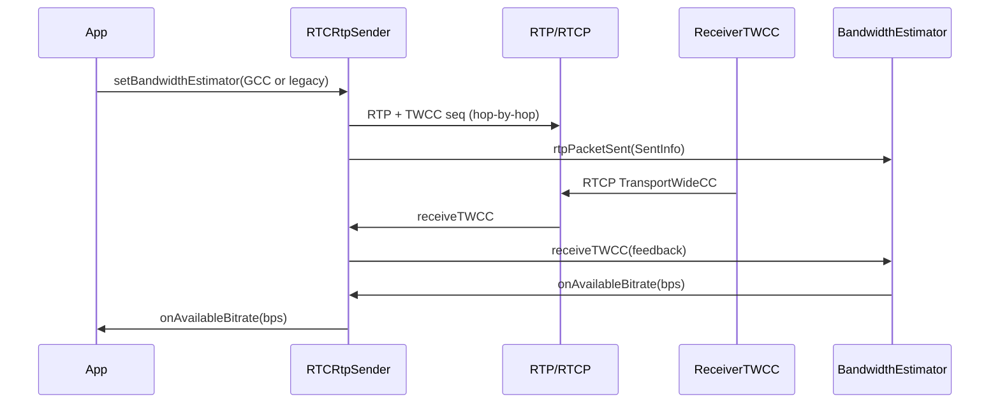
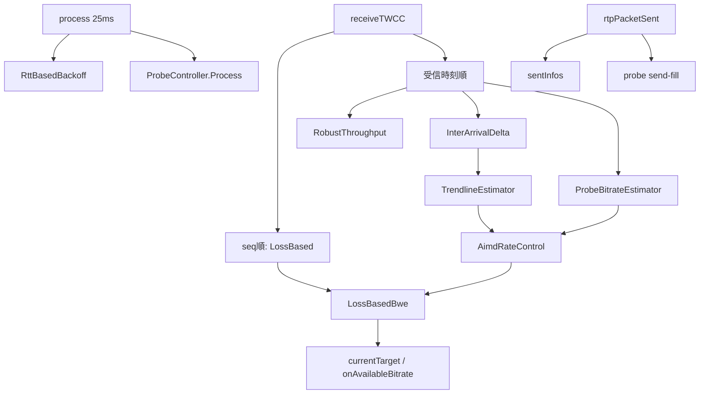

---
ide:
  viewer: review-document
  version: 1
  title: "TWCC と GCC — 実装に照らした仕組み解説"
  dock: right
  baseCommit: 3907484836eb53bce18caadf72c404e792f956d4
---
# TWCC と GCC — 実装に照らした仕組み解説

この文書は、werift の **TWCC（フィードバック機構）** と **GCC（送信側帯域推定アルゴリズム）** を、現行コードの呼び出し順に沿って説明します。仕様ドラフトそのものの要約ではなく、「どのファイルが何を担当し、パケットがどこを通るか」が主眼です。

## 1. 概要

TWCC と GCC は役割が違います。

| 層 | 役割 | 仕様 | werift の置き場 |
| --- | --- | --- | --- |
| TWCC | 送信時刻・到達/未到達を **観測して返す** | [draft-holmer-rmcat-transport-wide-cc-extensions-01](https://datatracker.ietf.org/doc/html/draft-holmer-rmcat-transport-wide-cc-extensions-01) | RTP 拡張 + RTCP FB + Receiver |
| 帯域推定 | 観測から **推奨送信ビットレート (bps)** を出す | 差し替え可能。既定は legacy、選択で GCC | `BandwidthEstimator` 実装 |
| アプリ | 推定値に追従する | 公開イベント | `RTCRtpSender.onAvailableBitrate` |

TWCC はアルゴリズムを規定しません。GCC / NADA / SCReAM などを sender 側で載せるための観測チャネルです。werift ではその切り分けを共通 interface に落としています。

[packages/webrtc/src/media/sender/bandwidthEstimator.ts:41](review-file:packages/webrtc/src/media/sender/bandwidthEstimator.ts:41) の契約は入力 `rtpPacketSent` / `receiveTWCC` と出力 `availableBitrate` / `onAvailableBitrate` に限定されます。probe・RTT・process 周期は capability 側です。

既定は mediasoup 由来の累積 min(send, recv) です。GCC にするときは setter で差し替えます。

[packages/webrtc/src/media/rtpSender.ts:117](review-file:packages/webrtc/src/media/rtpSender.ts:117) で `_senderBWE` は `SenderBandwidthEstimator` から始まり、
[packages/webrtc/src/media/rtpSender.ts:308](review-file:packages/webrtc/src/media/rtpSender.ts:308) の `setBandwidthEstimator` だけが入れ替え口です。

アプリが購読すべきなのは estimator 本体ではなく sender のブリッジです。

[packages/webrtc/src/media/rtpSender.ts:139](review-file:packages/webrtc/src/media/rtpSender.ts:139) の `onAvailableBitrate` は差し替え後も購読が残ります。単位は **bps**、値が変わったときだけ発火します。

<!-- review-bookmark id="bm_1a023df1fcc-622bf38e" title="1. 概要" -->
[packages/webrtc/src/media/sender/bandwidthEstimator.ts:196](review-file:packages/webrtc/src/media/sender/bandwidthEstimator.ts:196) の `setAvailableBitrateIfChanged` がその「変化時のみ」を実装しています。

<!-- review-bookmark id="bm_1a023e04634-57fcdcd4" title="1. 概要" -->


## 2. 主要変更（プロトコル経路）

### 2.1 送信側: transport-wide sequence の付与

各 RTP に 16-bit の transport-wide sequence（TSN）を載せます。カウンタは **DTLS transport 共有**、推定器は **sender ごと** です。

[packages/webrtc/src/media/rtpSender.ts:939](review-file:packages/webrtc/src/media/rtpSender.ts:939) で送信直前に `dtlsTransport.transportSequenceNumber` を進め、
[packages/rtp/src/rtp/headerExtension.ts:116](review-file:packages/rtp/src/rtp/headerExtension.ts:116) の `serializeTransportWideCC` が 2 バイトの拡張ペイロードを書きます。

TWCC / abs-send-time は hop-by-hop です。入力 RTP の古い TSN で上書きすると、ワイヤー上の TSN と BWE の `SentInfo.wideSeq` がずれます。

[packages/webrtc/src/media/rtpSender.ts:955](review-file:packages/webrtc/src/media/rtpSender.ts:955) は hop-by-hop ID を merge 対象から外しています。差分の意図は [packages/webrtc/src/media/rtpSender.ts:955](review-diff:packages/webrtc/src/media/rtpSender.ts:commit:b1957d5f:955) です。

送信完了後、TWCC が交渉済みなら `SentInfo` を estimator に渡します。

[packages/webrtc/src/media/rtpSender.ts:1031](review-file:packages/webrtc/src/media/rtpSender.ts:1031) で `wideSeq` / 実ワイヤーサイズ / probe cluster id / `priorUnackedBytes` を記録します。`size` は SRTP 後の実バイトです。TWCC 未交渉なら BWE も probe padding も動きません。

差し替え中に飛んだパケットが新しい estimator を汚染しないよう、`bweGeneration` が一致するときだけ `rtpPacketSent` します。

[packages/webrtc/src/media/rtpSender.ts:179](review-file:packages/webrtc/src/media/rtpSender.ts:179)

NACK/RTX も同じ `sendRtpInternal` を通り、**新しい TSN** が付きます。元パケットの TSN は再利用しません。

<!-- review-bookmark id="bm_1a033eb0341-f4dd14d3" title="2.1 送信側: transport-wide sequence の付与" -->
[packages/webrtc/src/media/rtpSender.ts:1215](review-file:packages/webrtc/src/media/rtpSender.ts:1215)

### 2.2 受信側: feedback 生成

受信側は到着を記録し、RTCP Transport-cc（FMT=15, PT=205）を返します。

[packages/webrtc/src/media/rtpReceiver.ts:456](review-file:packages/webrtc/src/media/rtpReceiver.ts:456) は拡張が **無い** パケットを `handleTWCC` に入れません（偽の TSN 0 を作らない）。

[packages/webrtc/src/media/receiver/receiverTwcc.ts:46](review-file:packages/webrtc/src/media/receiver/receiverTwcc.ts:46) の `ReceiverTWCC` は次の規則です。

- 周期 **100ms**、またはバッファ **>10 パケット** で送信
- ギャップは `PacketNotReceived`
- フィードバック境界をまたぐ損失は `nextReportTsn` で継続
- 遅延到着は約 **500ms** の history で訂正 feedback 可能
- `reference_time` は 64ms 量子化。最初の recv delta はその切り捨て基準からの差分

[packages/webrtc/src/media/receiver/receiverTwcc.ts:198](review-file:packages/webrtc/src/media/receiver/receiverTwcc.ts:198)

### 2.3 ワイヤー復元: `packetResults`

送信側が RTCP を受け取ると、status chunk と recv delta をパケット列に展開します。

[packages/rtp/src/rtcp/rtpfb/twcc.ts:238](review-file:packages/rtp/src/rtcp/rtpfb/twcc.ts:238) の `packetResults` は RunLength / StatusVector を **単一シーケンス cursor** で走査し、受信済みだけに delta を積んで `receivedAtMs` を復元します。`ReceivedWithoutDelta` は到達扱いだが遅延サンプルには使いません。

[packages/webrtc/src/media/rtpSender.ts:1186](review-file:packages/webrtc/src/media/rtpSender.ts:1186) がこの `TransportWideCC` を現在の estimator の `receiveTWCC` に渡します。

## 3. 主要変更（推定アルゴリズム）

### 3.1 Legacy（既定）

[packages/webrtc/src/media/sender/estimators/legacyCumulativeBwe.ts:27](review-file:packages/webrtc/src/media/sender/estimators/legacyCumulativeBwe.ts:27) の `SenderBandwidthEstimator` です。

1. `rtpPacketSent` で sent history を保持（**10 秒の時間窓**。件数 2048 ではない）
2. TWCC の受信済み＋タイミングありパケットを `CumulativeResult` に積む
3. 経過 ≥ 100ms かつ ≥ 20 パケットで `min(sendBitrate, receiveBitrate)`
4. 1 秒超の無更新で congestion counter / score を悪化（**legacy 固有**。共通 interface には載せない）

[packages/webrtc/src/media/sender/estimators/legacyCumulativeBwe.ts:109](review-file:packages/webrtc/src/media/sender/estimators/legacyCumulativeBwe.ts:109)

probe / token-bucket は legacy には掛けません。

### 3.2 GCC の構成

[packages/webrtc/src/media/sender/estimators/gcc/gccBwe.ts:98](review-file:packages/webrtc/src/media/sender/estimators/gcc/gccBwe.ts:98) の `GccBandwidthEstimator` は libwebrtc goog_cc の send-side を TypeScript に寄せたものです。構成は次のとおりです。



初期目標は **300 kbps**、下限 **5 kbps**（`kCongestionControllerMinBitrate`）。名前付き定数は [packages/webrtc/src/media/sender/estimators/gcc/constants.ts:10](review-file:packages/webrtc/src/media/sender/estimators/gcc/constants.ts:10) に集約しています。

### 3.3 `rtpPacketSent` — 履歴だけ（推定は回さない）

pin の `OnSentPacket` に合わせ、送信経路では推定を更新しません。

[packages/webrtc/src/media/sender/estimators/gcc/gccBwe.ts:542](review-file:packages/webrtc/src/media/sender/estimators/gcc/gccBwe.ts:542)

ここで行うのは ALR バイト計上、sent history（unwrap 済み TSN）、最初のパケットでの `UpdatePropagationRtt(send, 0)`、予約済み `probeClusterId` への send-fill です。`UpdateEstimate` と `ProbeController::Process` は **25ms の `process()`** 側です。

### 3.4 `process()` — pin `OnProcessInterval`

[packages/webrtc/src/media/sender/estimators/gcc/gccBwe.ts:352](review-file:packages/webrtc/src/media/sender/estimators/gcc/gccBwe.ts:352) の順は次です。

1. sent history の老化（最大 60s）
2. `UpdateEstimate`（高 RTT なら target ×0.8）
3. ALR 開始時刻の同期
4. `ProbeController::Process`
5. `propagateTarget`（イベント発火）

[packages/webrtc/src/media/rtpSender.ts:357](review-file:packages/webrtc/src/media/rtpSender.ts:357) が GCC のときだけ 25ms タイマを回します。legacy では動きません。

初期 3x/6x probe は **network available（DTLS connected）かつ ProcessInterval / SetBitrates の後** です。接続前に probe しません。

[packages/webrtc/src/media/sender/estimators/gcc/gccBwe.ts:511](review-file:packages/webrtc/src/media/sender/estimators/gcc/gccBwe.ts:511)

### 3.5 `receiveTWCC` — delay → probe → loss の順

ここが GCC の本流です。

[packages/webrtc/src/media/sender/estimators/gcc/gccBwe.ts:587](review-file:packages/webrtc/src/media/sender/estimators/gcc/gccBwe.ts:587)

処理の骨格:

1. 24-bit `reference_time` を unwrap して連続 ms にする
2. **loss は transport-seq 順**。PacketNotReceived は **soft loss**（永久 finalize しない。後から received なら訂正。繰り返し not-received も LossBased に渡す）
3. **delay / acked / probe は受信時刻順**
4. 2s 無サンプルなら InterArrival + Trendline を reset（`kStreamTimeOut`）
5. パケットごとに Trendline の before/after を見て `underuse → normal` を latch（feedback 間ではなく feedback **内**）
6. propagation RTT を `RttBasedBackoff` に渡す（AIMD には渡さない）
7. **Delay AIMD**（overuse なら減少、非 overuse で valid probe なら `SetEstimate(probe)`、それ以外は通常更新）
8. **その後** `LossBasedBwe.update`（post-probe の delay を入力）
9. post-loss の state から `GetBandwidthLimitedCause` と最終 target
10. delay `Result.updated === true` のときだけ `propagateTarget`（イベント）

[packages/webrtc/src/media/sender/estimators/gcc/gccBwe.ts:791](review-file:packages/webrtc/src/media/sender/estimators/gcc/gccBwe.ts:791)

上昇方向の独自 cap（acked×2 など）はありません。低い probe だけ `max(probe, min(delay, acked×0.85))` の floor があります。

[packages/webrtc/src/media/sender/estimators/gcc/gccBwe.ts:835](review-file:packages/webrtc/src/media/sender/estimators/gcc/gccBwe.ts:835)

LossBased が `IsReady()` になるまでは controller は loss 結果を target に採用しません。

### 3.6 Delay 経路: InterArrival → Trendline → AIMD

[packages/webrtc/src/media/sender/estimators/gcc/interArrivalDelta.ts:59](review-file:packages/webrtc/src/media/sender/estimators/gcc/interArrivalDelta.ts:59) は送信時刻 5ms バーストでグループ化し、完了グループ間の send/recv/size delta を出します。`firstSendMs` は固定、delta は latest send 同士。リオーダーは無視し、連続 3 回で reset します。

[packages/webrtc/src/media/sender/estimators/gcc/trendlineEstimator.ts:25](review-file:packages/webrtc/src/media/sender/estimators/gcc/trendlineEstimator.ts:25) は遅延勾配の線形回帰です。窓 20 パケットが埋まってから slope、`modified_trend = min(num_deltas, 60) * trend * 4.0`、適応閾値で **overuse / underuse / normal** を出します。独立した OveruseDetector クラスは実行時には使いません。

[packages/webrtc/src/media/sender/estimators/gcc/aimdRateControl.ts:17](review-file:packages/webrtc/src/media/sender/estimators/gcc/aimdRateControl.ts:17) の AIMD は pin の更新式です。

- 減少: `throughput × 0.85`、5 kbps 超ならさらに **−5 kbps**
- 増加上限: `1.5 × throughput + 10 kbps`
- 乗法増加: `1.08^Δt`、最低 +1000 bps/update
- 加法増加: `(RTT + 100ms) × 2`、最低 4000 bps/s
- `TimeToReduceFurther` は RTT を **[10, 200] ms** に clamp。既定 RTT は **200ms**

AIMD の RTT は **RTCP RR の raw サンプルだけ** です。stats 用 EWMA は混ぜません。

[packages/webrtc/src/media/rtpSender.ts:1155](review-file:packages/webrtc/src/media/rtpSender.ts:1155)

capability は [packages/webrtc/src/media/sender/bandwidthEstimator.ts:134](review-file:packages/webrtc/src/media/sender/bandwidthEstimator.ts:134) の `RoundTripTimeConsumer` です。共通 interface には載せていません。

### 3.7 Loss 経路: LossBasedBweV2 寄せ

[packages/webrtc/src/media/sender/estimators/gcc/lossBasedBwe.ts:43](review-file:packages/webrtc/src/media/sender/estimators/gcc/lossBasedBwe.ts:43)

状態は `increasing` / `increase_using_padding` / `decreasing` / `delay_based` です。HOLD は独立 state ではなく `decreasing` 内のタイマです。byte-loss、Newton、instant bound、acked-rate の ALR 扱い、commit 済み observation の非書き換え（late ACK は次 observation へ）が pin に揃えています。

controller は [packages/webrtc/src/media/sender/estimators/gcc/bandwidthLimitedCause.ts:34](review-file:packages/webrtc/src/media/sender/estimators/gcc/bandwidthLimitedCause.ts:34) の `getBandwidthLimitedCause` で probe 可否を決めます。

| 条件 | cause | 新規 probe |
| --- | --- | --- |
| delay overuse / underuse | `delay_based_limited_delay_increased` | 禁止 |
| CorrectedRtt > 3s | `rtt_based_back_off_high_rtt` | 禁止 |
| loss decreasing / increase_using_padding | `loss_limited_bwe` | 禁止 |
| loss increasing | `loss_limited_bwe_increasing` | 可（上限 ×1.5） |
| delay_based | `delay_based_limited` | 可 |

recovery probe は **underuse 中ではなく**、feedback 内の `underuse → normal` latch のときだけです。

[packages/webrtc/src/media/sender/estimators/gcc/gccBwe.ts:930](review-file:packages/webrtc/src/media/sender/estimators/gcc/gccBwe.ts:930)

### 3.8 Probe と pacing

[packages/webrtc/src/media/sender/estimators/gcc/probeController.ts:45](review-file:packages/webrtc/src/media/sender/estimators/gcc/probeController.ts:45) は `init` → `waiting_for_result` → `complete` です。初期は 3x / 6x を FIFO。further は ×2。exact max は `>=` で further 停止。

送信側の間隔は token-bucket 前払いではなく

`next_probe_time = started_at + sent_bytes / send_bitrate`

です。初期 `min_probe_delta` 20ms、その後 2ms。10ms 超遅延で **active** cluster 破棄。5s タイムアウトは **queued** だけです。

[packages/webrtc/src/media/sender/estimators/gcc/probeController.ts:308](review-file:packages/webrtc/src/media/sender/estimators/gcc/probeController.ts:308) の `reserveOutgoingProbe` は **送信前** に cluster id を予約し `SentInfo.probeClusterId` に載せます。非同期 send 完了時の「今の current cluster」には依存しません。

pacing 完了は send-fill（minBytes **かつ** minPackets）。80% ACK では pacing を切りません。controller の結果待ち（sender 1s）と estimator history（receive 1s + sender 側 60s cap）は分離しているので、pacing timeout 後の late TWCC でも推定できます。0 packet の timeout は history に入れません。

[packages/webrtc/src/media/rtpSender.ts:698](review-file:packages/webrtc/src/media/rtpSender.ts:698) がメディア不足時に RFC 3550 padding RTP を注入します。SR の octetCount は padding 前 payload のみです。

メディア pacing は [packages/webrtc/src/media/sender/estimators/gcc/gccBwe.ts:276](review-file:packages/webrtc/src/media/sender/estimators/gcc/gccBwe.ts:276) の `GetPacingRates` です。初回 TWCC 前 **2.5×**、以降 **1.1×**、probe 中は probe target との max。

[packages/webrtc/src/media/rtpSender.ts:167](review-file:packages/webrtc/src/media/rtpSender.ts:167) の `mediaPacingEnabled` は sim 用です。輻輳期にメディア pacer だけ切って生成レートをボトルネックへ出し、probe の `next_probe_time` は残します。

### 3.9 2 系統の RTT

混同しやすいので分離しています。

| 経路 | 入力 | 用途 |
| --- | --- | --- |
| TWCC propagation | `feedback_rtt − pending_time` の min | `RttBasedBackoff.IsRttAboveLimit` と target ×0.8 |
| RTCP RR raw | `timestamp − lastSR − DLSR` | AIMD `SetRtt` のみ |

[packages/webrtc/src/media/sender/estimators/gcc/rttBasedBackoff.ts:14](review-file:packages/webrtc/src/media/sender/estimators/gcc/rttBasedBackoff.ts:14)

`CorrectedRtt = max(last_sent − last_update, 0) + propagation`。フィードバック欠落中も送信が続くと timeout 分が伸び、3s 超で 1s ごとに target を ×0.8（床 5 kbps）。高 RTT のときは LossBased の結果よりこの backoff 後の上限を優先します（pin より先に loss で落としすぎない）。

acked bitrate は [packages/webrtc/src/media/sender/estimators/gcc/acknowledgedBitrateEstimator.ts:21](review-file:packages/webrtc/src/media/sender/estimators/gcc/acknowledgedBitrateEstimator.ts:21) の RobustThroughput です。TWCC 相対受信時刻 + send 時刻。`priorUnackedBytes`（TWCC 未追跡分、RTX など）を send/recv size に加算します。壁時計には依存しません。

## 4. 判断理由

1. **共通 interface を薄く保つ**  
   アプリは `onAvailableBitrate(bps)` だけ追えば足りる。overuse や congestion score はアルゴリズム固有です。probe / RTT / process は type guard で GCC にだけ付けています。

2. **libwebrtc の実行順を source of truth にする**  
   draft-ietf-rmcat-gcc と Chromium が分かれるときは goog_cc 側です。定数・状態機械・更新式は簡略フォールバックで完了としません。意図的な差は [packages/webrtc/src/media/sender/estimators/gcc/constants.ts:427](review-file:packages/webrtc/src/media/sender/estimators/gcc/constants.ts:427) の `GCC_KNOWN_DIFFERENCES` に書いてあります。

3. **TWCC は観測、推定は差し替え**  
   Receiver / serialize はアルゴリズム非依存のまま残し、sender の配送先だけを interface にしました。デフォルト legacy なので既存アプリは無変更です。

4. **イベントは変化時のみ、sender で安定購読**  
   差し替えのたびにアプリが再 subscribe しなくてよいように、`RTCRtpSender` がブリッジします。例は [examples/mediachannel/twcc/offer.ts:66](review-file:examples/mediachannel/twcc/offer.ts:66) と [examples/mediachannel/simulcast/abr.ts:80](review-file:examples/mediachannel/simulcast/abr.ts:80) です。

5. **差し替えはクリーン開始**  
   旧インスタンスは dispose/reset、新インスタンスも reset、世代番号で in-flight を破棄、probe padding も止めます。状態の暗黙マージはありません。

## 5. リスク / 既知差分

ピン完全一致ではない箇所です。詳細は `GccBandwidthEstimator.knownDifferences` です。

- **軽量 pacer**: 本家 `PacedSender` ではなく token-bucket + probe `next_probe_time`。アプリが `onAvailableBitrate` に追従する前に送信を絞るため、ボトルネック sim は輻輳期だけ `mediaPacingEnabled = false` にします。
- **REMB 未配線**: TWCC-only。将来統合は非ゴール。
- **ALR 周期 probe は既定オフ**: 明示 `periodicAlrProbing` が必要。
- **RR `updatePacketsLost` 未配線**: start-phase の fraction-loss ゲートは TWCC 主経路としては許容。
- **数値**: float / 時計分解能のため C++ 公開ベクトルとの bit 完全一致は保証しない。
- **マルチ sender**: TSN は transport 共有、BWE は sender ごと（意図的）。
- **sim は CI 外**: `packages/webrtc` の `npm run test:sim` と `e2e` の `npm run test:sim` を手で回す前提です。

## 6. 検証結果

この文書は実装解説であり、追加のコード変更はありません。既存の検証基盤は次です。

| 対象 | 内容 |
| --- | --- |
| 単体 | delay / loss / probe / wrap / gap / RTT / 差し替え汚染 など `packages/webrtc/tests` |
| ワイヤー | `packages/rtp/tests/rtcp/rtpfb/twcc.test.ts` |
| peer sim §2.8 | ボトルネックで推定低下、追従後ドロップ減（CI 外） |
| Chrome sim §2.9 | 同上 + Chrome `getStats`（CI 外） |

アプリから GCC を使う最短経路:

```ts
import { GccBandwidthEstimator } from "werift";

sender.onAvailableBitrate.subscribe((bps) => {
  // encoder / simulcast を bps に合わせる
});
sender.setBandwidthEstimator(new GccBandwidthEstimator());
```

公開 API の要約は [doc/README.md:52](review-file:doc/README.md:52) です。
